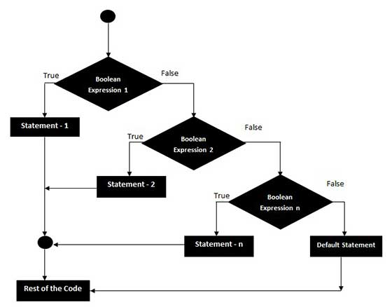
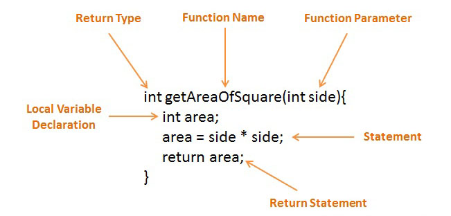
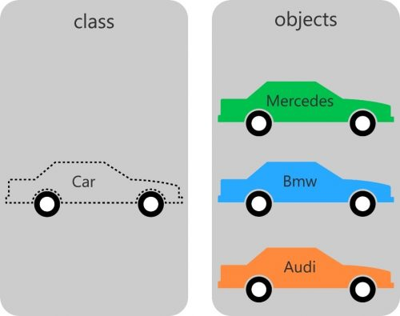

# [STS-10] 웹프로그래밍 :: 짧고 굵게 배우기

[![Dinfree][din-badge]][din-url]
[![Subject][basic-badge]][din-url]

[STS-10]은 웹프로그래밍의 핵심 개념에서 부터 주요 기술인 html, css, javascript를 비롯해 필수 응용 라이브러리인 bootstrap, jquery까지를 다루는 과정 입니다.

 ## 프로그래밍 언어 개요
컴퓨터 사용이 익숙하지 않은 분들을 위한 기초 학습 입니다. 컴퓨터와 운영체제, 파일관리 및 명령프롬프트 사용, 크롬 웹 브라우저 등 
프로그램 개발 이전에 반드시 알아야 할 컴퓨터 사용법에 대해 다루게 됩니다. 만일 컴퓨터 사용이 익숙하다면 이번 장은 넘어가도 됩니다.

### 목차
1. [자료형](#m1)
2. [조건문과 반복문](#m2)
3. [함수](#m3)
4. [객체지향 프로그래밍](#m4)
<!--
5. [개발도구 설치 - 자바 & 이클립스](#m5)
6. [개발도구 설치 - git](#m6)
7. [개발도구 설치 - intelliJ](#m7)
8. [개발도구 설치 - VS Code](#m8)
-->

---
<a id="m1"></a>

## 1. 자료형

자료형은 해당 데이터의 메모리 저장방식과 프로그램 처리방식을 명시적으로 알려줍니다. 기본 타입은 `정수형, 실수형, 문자형`으로 나뉩니다.

#### 1) 정수형
정수란 `부호를 가지고 소수가 없는 수`를 의미합니다. `unsigned 정수는 음수를 표현할 수는 없지만, 0을 포함한 양의 정수를 두 배` 더 많이 표현합니다. 음의 정수까지 표현할 수 있는 `signed 키워드가 모든 타입에서 기본값`이 됩니다.

| type   | 할당메모리 크기 | 데이터의 표현 범위              |
|----------------|------------------------|---------------------------------|
| (signed) short | 2byte               | - 32,768 ~ 32,767               |
| unsigned short | 2byte               | - 0 ~ 65,535                    |
| (signed) int   | 4byte               | - 2,147,483,648 ~ 2,147,483,647 |
| unsigned int   | 4byte               | - 0 ~ 4,294,967,296             |
| (signed) long  | 4byte               | - 2,147,483,648 ~ 2,147,483,647 |
| unsigned long  | 4byte               | - 0 ~ 4,294,967,296             |

- 정수형 타입 결정 시 데이터의 최대 크기를 고려해야 합니다.
- 해당 타입의 표현범위를 벗어나면 오버플로우가 발생합니다.
  - `오버플로우(overflow)` - 해당 타입의 표현범위 이상의 수를 저장할 때 발생.
  - `언더플로우(underflow)` - 해당 타입의 표현범위 이하의 수를 저장할 때 발생.


#### 2) 실수형
실수란 `소수부나 지수가 있는 수`를 가리키며 정수보다 더 넓은 표현 범위를 가집니다.

| type | 할당메모리 크기 | 데이터의 표현 범위             |
|-------------|------------------------|--------------------------------|
| float       | 4byte               | (3.4 X 10E-308) ~ (3.4 X 10E308)   |
| double      | 8byte               | (1.7 X 10E-308) ~ (1.7 X 10E308) |
| long double | 8byte     | (1.7 X 10E-308) ~ (1.7 X 10E308)           |


#### 3) 문자형
문자형 데이터란 `문자 하나를 표현할 수 있는 타입`을 의미합니다. 컴퓨터는 2진수까지 인식할 수 있어 문자도 숫자로 표현해야 합니다. 따라서 어떤 문자를 어떤 숫자에 대응시킬 것인가에 대한 약속이 필요한데 그것을 `아스키코드(ASCII)`라고 합니다.

| type   | 할당메모리 크기 | 데이터의 표현 범위 |
|---------------|------------------------|--------------------|
| (signed) char | 1byte              | -128 ~ 128         |
| unsigned char | 2byte               | 0 ~ 256            |

> 아스키코드(ASCII)는 영문 대소문자를 사용하는 `7비트의 문자 인코딩 방식`으로 총 128개의 문자를 표현할 수 있습니다. 아스키코드는 영문 대소문자 52개와 숫자 10개 그리고 특수문자 32개 등으로 구성됩니다.


### 동영상 강좌
- 변수와 상수
  > https://bit.ly/2ocvOnG `13:52`
- C언어의 자료형
  > https://bit.ly/2MuKMEl `11:38`
- Java - 변수 선언과 할당
  > https://bit.ly/2MSOdE9 `06:23`
- Java - 상수형 데이터 타입
  > https://bit.ly/2MTn7g6 `13:00`


### 참고 자료
- 데이터타입
  > https://bit.ly/2P7bijV


### 퀴즈
#### 1) 영문 대소문자를 사용하는 7비트의 문자 인코딩 방식은 무엇입니까?
<details>
<summary>해답보기</summary>
<p></p>
<div markdown="1">

- 아스키코드

</div>
</details> 

<br>

---
<a id="m2"></a>

## 2. 조건문과 반복문

### 조건문   
조건문은 주어진 조건식의 결과에 따라 별도의 명령을 수행하도록 제어하는 명령문입니다.



#### 1) if문
조건식의 결과가 참(true)이면 명령문 실행하고 거짓(false)이면 아무것도 실행하지 않습니다.

<!--

-->
```c
if(a == 1) {
  printf("a는 1입니다.");
}
```

#### 2) if/else문
if문과 함께 사용하는 else문은 주어진 조건식의 결과가 거짓(false)이면 주어진 명령문을 실행합니다.
<!--

-->
```c
if(a == 1) {
  printf("a는 1입니다.");
} else {
  printf("a는 1이 아닙니다.");
}
```

#### 3) if/else if/else 문
else if문은 중첩된 if문을 간결하게 표현할 수 있도록 해줍니다. 하나의 조건문 안에서 if문과 else문은 한 번만 사용될 수 있습니다. 하지만 else if문은 여러 번 사용될 수 있어서 복잡한 조건도 표현할 수 있습니다.
<!--

-->

```c
if(a == 1) {
  printf("a는 1입니다.");
} else if (a == 2) {
  printf("a는 2입니다.");
} else {
  printf("a는 1도 아니고, 2도 아닙니다.");
}
```

### 반복문
반복문이란 프로그램 내에서 똑같은 명령을 일정 횟수만큼 반복하여 수행하도록 제어하는 명령문입니다. 프로그램이 처리하는 대부분의 코드는 반복적인 형태가 많아 가장 많이 사용됩니다.

#### 1) while문
while문은 특정 조건을 `만족할 때까지 계속해서 주어진 명령문을 반복 실행`합니다. while문은 우선 조건식이 참(true)인지를 판단하여 내부의 명령문을 실행합니다. 

```c
int a = 0;

while(true) {
  a++;
  printf("a가 10이 될때까지 실행합니다.");

  if(a = 10){
    break;
  }
}
```

<!--

-->
<!--
이렇게 내부의 명령문을 전부 실행하고 나면, 다시 조건식으로 돌아와 또 한 번 참인지를 판단하게 됩니다. 이렇게 표현식의 검사를 통해 반복해서 실행되는 반복문을 루프(loop)라고 합니다.

- while문 내부에 조건식의 결과를 변경하는 명령문이 존재하지 않을 때는 프로그램이 영원히 반복되게 됩니다. 이것을 무한 루프(infinite loop)에 빠졌다고 합니다.
- 반복문에서 조건식의 거짓일때 반복문이 종료가되지만, 무한루프는 조건식의 거짓이 없이 항상 참이므로 반복문이 종료되지 않고 무한히 실행되는 반복문을 말합니다. 무한 루프에 빠진 프로그램은 영원히 종료되지 않습니다.
- 무한 루프는 특별히 의도한 경우가 아니라면 반드시 피해야 하는 상황입니다.
- 따라서 while 문을 작성할 때는 조건식의 결과가 어느 순간 거짓(false)을 갖도록 조건식의 결과를 변경하는 명령문을 반드시 포함시켜야 합니다.
-->

#### 2) do while문
while문은 루프에 진입하기 전, 먼저 조건식부터 검사합니다. 하지만 do while문은 `먼저 루프를 한 번 실행한 후에 조건식을 검사`합니다. 즉, do while문은 조건식의 결과와 상관없이 무조건 한 번은 루프를 실행합니다.

```c
int a = 0;
do {
  printf("일단 실행합니다.");
  a++;
} while(a < 10);
```

#### 3) for문
for문은 while문과 달리 자체적으로 `초기식, 조건식, 증감식`을 모두 포함하고 있는 반복문입니다. 따라서 while문보다는 간결하게 반복문을 표현할 수 있습니다.

```c
for (int i=0; i<10; i++) {
  printf("이 실행문을 10번 수행합니다.");
}
```

### 동영상 강좌
- C언어 - 조건문과 반복문
  > https://bit.ly/2MB9K4O  `07:17`
- 조건 연산자와 조건문
  > https://bit.ly/2wt34ep `06:56`
- 프로그래밍이란
  > https://bit.ly/2JRfXDO `01:29`
- 프로그래밍이란 무엇인가
  > https://bit.ly/2Ljl4SR `03:31`
    

### 참고 자료
- 반복문
  > https://bit.ly/2Njpiqh
- 조건문
  > https://bit.ly/2P4OCAQ


### 퀴즈
#### 1) 조건문에는 어떤 문법이 있는가?
<details>
<summary>해답보기</summary>
<p></p>
<div markdown="1">

- if문
- if/else문
- if/else if/else문
- switch문

</div>
</details> 

#### 2) 반복문에는 어떤 문법이 있는가?
<details>
<summary>해답보기</summary>
<p></p>
<div markdown="1">

- while문
- do while문
- for문

</div>
</details> 

<br>

---
<a id="m3"></a>

## 3. 함수

#### 1) 사용 이유
- `반복적인 프로그래밍을 피하기위해` 함수를 사용합니다.
- `모듈화`로 인해 전체적인 코드의 가독성이 좋아집니다.
- 문제가 발생하거나 기능 변경이 필요할 때에도 `손쉽게 유지보수`를 할 수 있습니다.

#### 2) 함수 구조



- Return Type - 함수가 모든 작업을 마치고 반환하는 데이터의 타입.
- Function Name - 함수를 호출하기 위한 이름.
- Parameter - 함수 호출 시에 전달되는 인수의 값을 저장할 변수.
- Statement - 함수의 기능을 수행하는 명령문.

<!--
- 함수호출 시 인수는 여러 개 전달할 수 있지만, 반환 값은 하나 뿐입니다.
- 함수의 특성에 따라 인수나 반환값이 하나도 없는 함수도 존재할 수 있습니다.
-->

### 동영상 강좌
- [C언어 8] 함수 (제대로 배우는 C언어 프로그래밍)
  > https://bit.ly/2P6L8xH `1:08:47`
- Python & Ruby - 함수 1 : 함수란 무엇인가?
  > https://bit.ly/2PF293l `09:14`
- #44 함수를 사용하는 이유 | 파이썬 강좌 코딩 기초 강의 Python | 김왼손의 왼손코딩
  > https://bit.ly/2wpvKol `03:57`


### 퀴즈
#### 1) 함수를 사용하는 이유는?
<details>
<summary>해답보기</summary>
<p></p>
<div markdown="1">

> 반복적인 프로그래밍을 피하기 위해서.

</div>
</details> 

<br>

---
<a id="m4"></a>

## 4. 객체지향 프로그래밍



#### 1) 클래스(Class)
클래스와 객체는 길가에서 파는 붕어빵으로 간단히 비유하여 이해할 수 있습니다. 프로그래머 관점에서는 붕어빵 틀이 클래스(class)이며, 붕어빵 하나하나를 객체(object)라고 이해할 수 있습니다.

- `클래스(class)`란 무언가를 계속 똑같이 만들어낼 수 있는 `설계도`와 같습니다.
- `객체(object)`란 클래스로 만들어낸 제품을 의미합니다.

#### 2) 클래스 구성
- 속성 - 클래스가 가지는 변수.
- 동작 - 클래스가 할 수 있는 동작.

> 모든 물체를 속성과 동작으로 분리해서 분석해보는 습관을 들이면 클래스를 디자인하는데 쉽게 접근할 수 있습니다. 이러한 방식으로 프로그래밍을 설계하는 것을 `객체 지향 프로그래밍(Object Oriented Programming)`이라고 합니다.
 
#### 3) 객체(Object)
- `하나의 클래스로부터 여러 개의 객체가 생성`될 수 있지만 각각은 서로 유일합니다.
- 객체는 `독립적인 특성`을 가집니다. 객체A의 속성값을 변경하여도 객체B의 속성값은 변하지 않습니다. 

- 객체 지향의 특징
  - `추상화(Abstraction)` - 만들고자 하는 것들의 공통적인 것을 바탕으로 하나로 묶는 것.
  - `캡슐화(Encapsulation)` - 맡은 역할의 수행을 위해 최소한의 외부 접근만을 허용하는 것.
  - `다형성(Polymorphism)` - 자료형에 구애 받지 않고 프로그래밍 하는 것.
  - `상속(Inheritance)` - 하위 개념이 상위 개념의 속성 및 동작 등을 물려받는 것.


### 동영상 강좌
- 객체 지향 프로그래밍이란?
  > https://bit.ly/2obmJvJ `14:04`
- 객체지향 (OOP): 클래스와 오브젝트 한방에 이해하기
  > https://bit.ly/2NnVgC0 `11:26`
    

### 참고 자료
- 객체지향 프로그래밍
  > https://bit.ly/2MzwBxR
    

### 퀴즈
#### 1) 객체지향의 특징 4가지를 쓰시오.
<details>
<summary>해답보기</summary>
<p></p>
<div markdown="1">

- 추상화
- 캡슐화
- 다형성
- 상속

</div>
</details> 


[din-badge]:https://img.shields.io/badge/dinfree-edu-orange.svg
[din-url]:https://github.com/dinfree
[basic-badge]:https://img.shields.io/badge/core-basic-green.svg