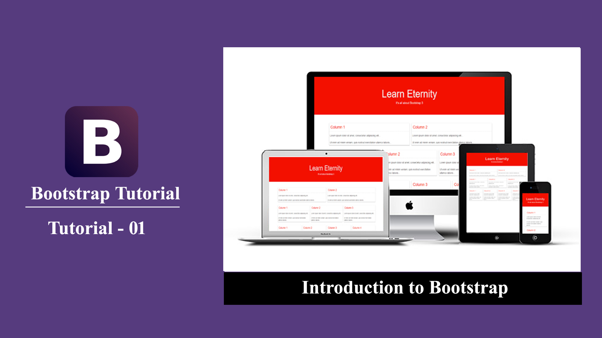
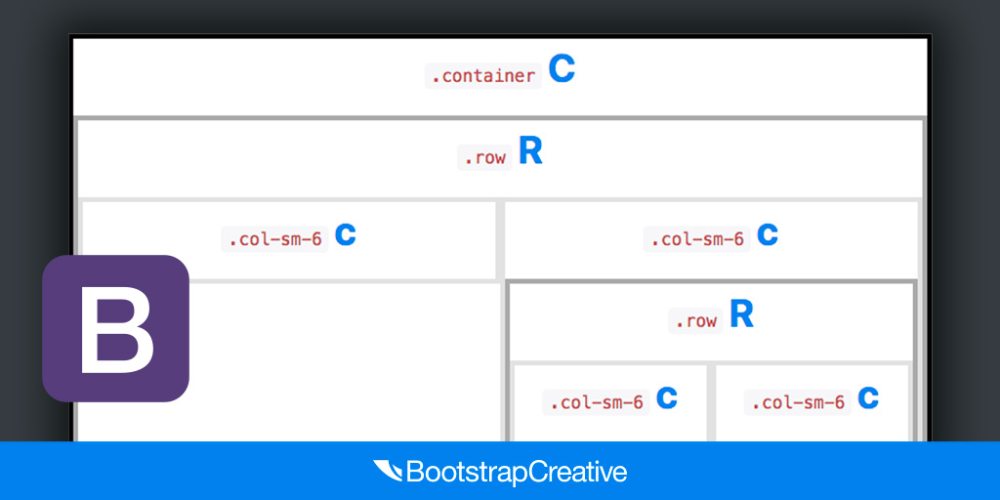

# [STS-10] 웹프로그래밍 :: 짧고 굵게 배우기

[![Dinfree][din-badge]][din-url]
[![Subject][basic-badge]][din-url]

[STS-10]은 웹프로그래밍의 핵심 개념에서 부터 주요 기술인 html, css, javascript를 비롯해 필수 응용 라이브러리인 bootstrap, jquery까지를 다루는 과정 입니다.

## 부트스트랩
부트스트랩은 웹 페이지 제작을 좀 더 쉽고 효율적으로 할 수 있게 도와줍니다. 부트스트랩이 무엇인지에 대해 소개하고 이것을 사용함으로써 얻을 수 있는 이점에 대해 알아봅니다. HTML에 부트스트랩을 적용시키는 다양한 방법을 학습합니다. 부트스트랩은 일종의 그리드 시스템으로 12개의 칼럼을 이용하여 화면을 배치합니다. 

### 목차
1. [소개](#m1)
2. [기본 사용법](#m2)

---
<a id="m1"></a>
## 1. 소개
부트스트랩은 빠르고 쉬운 웹 개발을 위한 무료 프론트엔드 프레임워크입니다. 부트스트랩에는 타이포그래피, 폼, 버튼, 테이블, 네비게이션, 이미지 및 JavaScript 플러그인을 위한 HTML 및 CSS 기반 디자인 템플릿이 포함되어 있습니다.


<p></p>

- 부트스트랩은 웹사이트를 쉽게 만들 수 있게 도와주는 HTML, CSS, JavaScript의 프레임워크입니다.
- 부트스트랩을 이용하면 반응형 디자인을 쉽게 만들 수 있습니다.
- 다양한 기능으로 사용자가 쉽게 제작, 유지, 보수 할 수 있도록 도와줍니다.
- 부트스트랩은 CSS 라이브러리이므로 외부 부트스트랩 라이브러리를 먼저 HTML에 포함시켜야 합니다.
```
<!-- Latest compiled and minified CSS -->
<link rel="stylesheet"href="https://maxcdn.bootstrapcdn.com/bootstrap/4.1.0/css/bootstrap.min.css">

<!-- jQuery library -->
<scriptsrc="https://ajax.googleapis.com/ajax/libs/jquery/3.3.1/jquery.min.js"></script>

<!-- Popper JS -->
<scriptsrc="https://cdnjs.cloudflare.com/ajax/libs/popper.js/1.14.0/umd/popper.min.js"></script>

<!-- Latest compiled JavaScript -->
<scriptsrc="https://maxcdn.bootstrapcdn.com/bootstrap/4.1.0/js/bootstrap.min.js"></script>
```


### 동영상 강좌
- 부트스트랩 개요
  > https://bit.ly/2vDfY9k `12:33` 
- 부트스트랩 소개
  > https://bit.ly/2n7KKmP `06:16`
- 부트스트랩 설치
  > https://bit.ly/2ObrSin `07:50`
- 부트스트랩 소개 및 개발환경 구축하기
  > https://bit.ly/2LQnEjo `11:19`


 <!-- 37:58 -->

### 참고 자료
- w3school - Bootstrap3
  > https://bit.ly/2l8hzQe
- w3school - Get Started
  > https://bit.ly/2mP58v9
- Tech Altum Tutorial - Bootstrap Tutorial
  > https://bit.ly/2O8Egzj

### 퀴즈
#### 1) 부트스트랩이 무엇입니까?
<details>
<summary>해답보기</summary>
<p></p>
<div markdown="1">

> 빠르고 쉬운 웹 개발을 위한 무료 프론트엔드 프레임워크
</div>
</details>

#### 2) 부트스트랩을 사용하는 이유는 무엇입니까?
<details>
<summary>해답보기</summary>
<p></p>
<div markdown="1">

> 사용이 용이하며, 반응형웹을 손쉽게 만들 수 있고 브라우저와의 호환성도 좋다.
</div>
</details>

<br />

---
<a id="m2"></a>
## 2. 기본 사용법
부트스트랩의 그리드 시스템은 페이지 전체에 `최대 12개의 컬럼`을 허용합니다. 12개의 열을 모두 개별적으로 사용하지 않으려면 열을 `그룹화`하여 더 넓은 열을 만들 수 있습니다. 부트스트랩의 그리드 시스템이 반응하며 `화면 크기에 따라 열이 자동으로 재배열`됩니다.


<p></p>

#### 그리드시스템 5가지 클래스
- `.col-` : 초소형 장치 (576px 미만)
- `.col-sm-` : 소형 장치 (576px 이상)
- `.col-md-` : 중형 장치 (768px 이상)
- `.col-lg-` : 대형 장치 (992px 이상)
- `.col-xl-` : 초대형 장치 (1200px 이상)

##### 예시) 3개의 동일한 열
```html
<div class="row">
  <div class="col-sm-4">4-Block</div>
  <div class="col-sm-4">4-Block</div>
  <div class="col-sm-4">4-Block</div>
</div>
```
##### 예시) 2개의 다른 열
```html
<div class="row">
  <div class="col-sm-4">4-Block</div>
  <div class="col-sm-8">8-Block</div>
</div>
```

### 동영상 강좌
- 부트스트랩 기본 사용법
  > https://bit.ly/2O9H8ME `07:55`
- 부트스트랩 사용법 - 기본 페이지
  > https://bit.ly/2AIBTSd `10:13`

 <!-- 18:08 -->

### 참고 자료
- w3school - Bootstrap Grids
  > https://bit.ly/2DaTJhi

### 퀴즈
#### 1) 2대 1 비율을 가진 너비를 구성하시오.
<details>
<summary>해답보기</summary>
<p></p>
<div markdown="1">

```html
<div class="row">
  <div class="col-sm-8">8-Block</div>
  <div class="col-sm-4">4-Block</div>
</div>
```
</div>
</details>


[din-badge]:https://img.shields.io/badge/dinfree-edu-orange.svg
[din-url]:https://github.com/dinfree
[basic-badge]:https://img.shields.io/badge/core-basic-green.svg