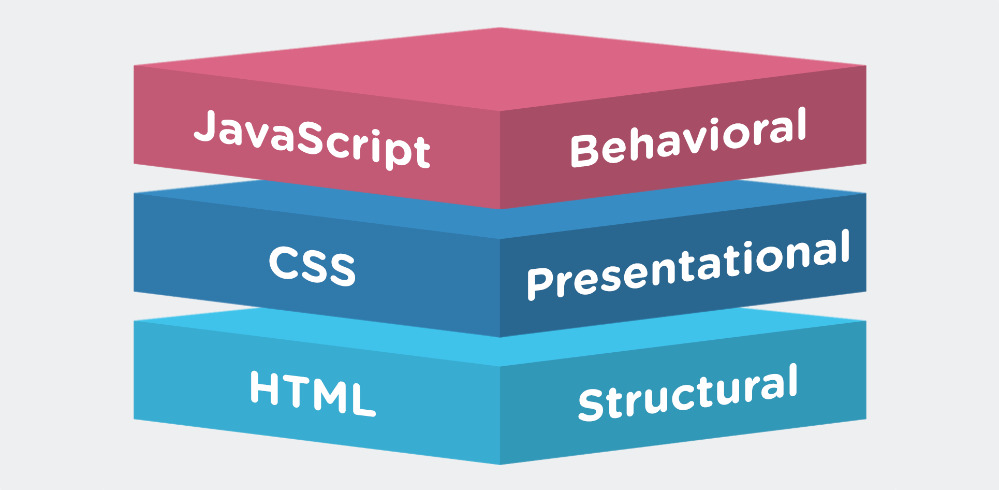
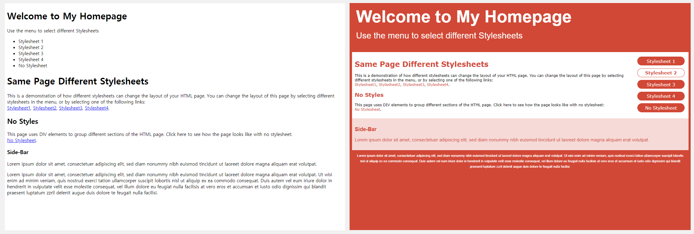
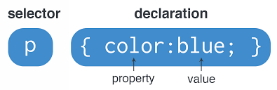
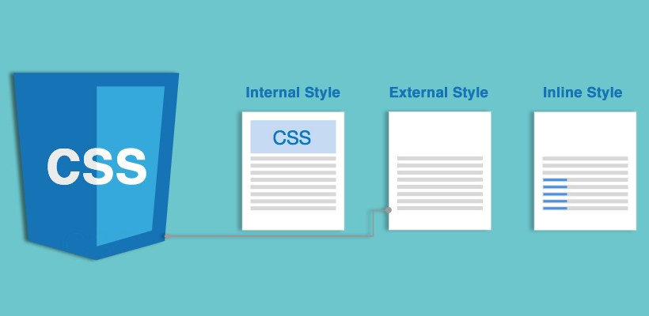

# [STS-10] 웹프로그래밍 :: 짧고 굵게 배우기

[![Dinfree][din-badge]][din-url]
[![Subject][basic-badge]][din-url]

[STS-10]은 웹프로그래밍의 핵심 개념에서 부터 주요 기술인 html, css, javascript를 비롯해 필수 응용 라이브러리인 bootstrap, jquery까지를 다루는 과정 입니다.

## CSS 개념 이해
이부분은 해당 챕터에 대한 설명과 안내가 나와야 하는데 우선 이부분은 비워 두도록 한다. 이부분은 해당 챕터에 대한 설명과 안내가 나와야 하는데 우선 이부분은 비워 두도록 한다.이부분은 해당 챕터에 대한 설명과 안내가 나와야 하는데 우선 이부분은 비워 두도록 한다.이부분은 해당 챕터에 대한 설명과 안내가 나와야 하는데 우선 이부분은 비워 두도록 한다.이부분은 해당 챕터에 대한 설명과 안내가 나와야 하는데 우선 이부분은 비워 두도록 한다.

### 목차
1. CSS 소개
2. 사용 이유
3. 기본 문법
4. 포함 방법

---
## 1. CSS 소개

소제목에 대한 간단한 설명이 와야 합니다. 최대한 간결하게 해당 소제목의 내용중 핵심을 설명합니다. 설명과 함께 목록등이 올 수 있으며 반드시 하나 이상의 이미지와 설명이 있어야 합니다. 단, 내용이 너무 길어지지 않도록 작성 합니다.



- CSS란 <strong>`Cascading Style Sheet`</strong>의 약자로써, HTML 문서를 표현하는 방법을 기술하는 언어이다.
- 웹 페이지의 <strong>`내용(HTML)`</strong>과 <strong>`스타일(CSS)`</strong>을 분리해주어 작업을 효율적으로 수행할 수 있도록 도와준다.
- HTML에 스타일을 입히는 언어이다.

### 동영상 강좌
- 스타일과 스타일시트는 무엇인가?
  > https://bit.ly/2O7vd2z (00:00 ~ 03:14) <!-- 03:14-->
- CSS 소개: HTML과 CSS
  > https://bit.ly/2JKpUCC <!--15:21-->
- CSS 소개 및 기본 구조
  > https://bit.ly/2LBbiY1 (00:00 ~ 02:07) <!--02:07-->

 <!--20분 42초-->

### 참고 자료
- w3school - CSS 정의
  > https://bit.ly/2skLnhw 
- ofcourse - CSS 개요
  > https://bit.ly/2O7dgkA
- MDN web docs - How CSS works
  > https://mzl.la/2dggA9Q


### 퀴즈
#### 1) CSS는 무엇의 약자인가요?
<details>
<summary>해답보기</summary>
<p></p>
<div markdown="1">

```
Cascading Style Sheet
```
</div>

</details>

#### 2) HTML에 CSS를 추가할 때, 웹 페이지에서 달라지는 점은 무엇입니까?
<details>
<summary>해답보기</summary>
<p></p>
<div markdown="1">

- 레이아웃
- 디자인
</div>

</details>

<br />

## 2. 사용 이유

소제목에 대한 간단한 설명이 와야 합니다. 최대한 간결하게 해당 소제목의 내용중 핵심을 설명합니다. 설명과 함께 목록등이 올 수 있으며 반드시 하나 이상의 이미지와 설명이 있어야 합니다. 단, 내용이 너무 길어지지 않도록 작성 합니다.



- 화면 크기가 다른 기기들의 사이즈를 제어해주며, 웹 페이지의 레이아웃과 디자인을 구성한다.
- 하나의 HTML파일와 여러 개의 CSS파일이 존재할 때, 다양한 디자인의 웹 페이지를 구성할 수 있다.


### 동영상 강좌
- CSS 목적 및 역사
  > https://bit.ly/2uODijQ (08:45 ~ 12:06) <!--03:21-->
- CSS 등장배경
  > https://bit.ly/2Lsa1Ga <!--10:44-->

 <!--14분 05초-->

### 참고 자료
- w3school - CSS 사용이유, 목적
  > https://bit.ly/2skLnhw 

### 퀴즈
#### 1) CSS를 사용하는 이유는 무엇입니까?
<details>
<summary>해답보기</summary>
<p></p>
<div markdown="1">

```
~~~~하기 위해서
```
</div>

</details>

<br />

## 3. 기본 문법

소제목에 대한 간단한 설명이 와야 합니다. 최대한 간결하게 해당 소제목의 내용중 핵심을 설명합니다. 설명과 함께 목록등이 올 수 있으며 반드시 하나 이상의 이미지와 설명이 있어야 합니다. 단, 내용이 너무 길어지지 않도록 작성 합니다.



- CSS규칙은 <strong>`선택자(selector)`</strong>와 <strong>`선언부(declaration)`</strong>로 구성된다.
- 모든 HTML요소가 선택자가 될 수 있다.


### 동영상 강좌
- CSS 규칙
  > https://bit.ly/2uODijQ (12:08 ~ 20:20) <!--08:12-->
- 실시간 코딩을 통한 CSS 기본 문법 알아보기
  > https://bit.ly/2fbTQN5 <!--05:06-->
- 기본 문법에 따른 실습 강의
  > https://bit.ly/2AzKrKR (02:07 ~ 06:33) <!--04:26-->

 <!--17분 44초-->

### 참고 자료
- w3school - CSS 기본 문법
  > https://bit.ly/2skLnhw 
- ofcourse - CSS 사용법, 주석
  > https://bit.ly/2O7dgkA
- MDN web docs - CSS syntax
  > https://mzl.la/2LUDsRj

### 퀴즈
#### 1) h1 태그 색상을 'green'으로 하는 CSS 문법을 쓰시오.
<details>
<summary>해답보기</summary>
<p></p>
<div markdown="1">

```css
<style>
h1 {
    color: green;
}
</style>
```
</div>

</details>

#### 2) 위 코드에 font가 'Gothic'인 스타일을 추가하시오.
<details>
<summary>해답보기</summary>
<p></p>
<div markdown="1">

```css
h1 {
    color: green;
    font-family: Gothic;
}
```
</div>

</details>

<br />

## 4. 포함 방법

소제목에 대한 간단한 설명이 와야 합니다. 최대한 간결하게 해당 소제목의 내용중 핵심을 설명합니다. 설명과 함께 목록등이 올 수 있으며 반드시 하나 이상의 이미지와 설명이 있어야 합니다. 단, 내용이 너무 길어지지 않도록 작성 합니다.



- CSS의 포함방법에는 <strong>`내부 스타일시트, 외부 스타일시트, 인라인 스타일`</strong> 총 3가지가 있다.
  
##### 1) 내부 스타일시트
```html
<style>
body {
    background-color: linen;
}

h1 {
    color: maroon;
    margin-left: 40px;
} 
```
##### 2) 외부 스타일시트
```html
<link rel="stylesheet" type="text/css" href="mystyle.css">
```
##### 3) 인라인 스타일
```html
<h1 style="color:blue;margin-left:30px;">This is a heading</h1>
```


### 동영상 강좌
- HTML과 CSS가 만나는 법
  > https://bit.ly/2mEZhGt <!--06:50-->
- HTML 문서와 CSS 연결 방법
  > https://bit.ly/2uODijQ (22:52 ~ 27:00) <!--04:08-->
- 내부 스타일시트, 외부 스타일시트, 인라인 스타일
  > https://bit.ly/2LDZG6K (05:15 ~ 09:43) <!--04:28-->
- 외부 스타일시트 실습 강의
  > https://bit.ly/2O7eNHm <!--05:02-->
- CSS 재사용
  > https://bit.ly/2NxvIlm <!--05:03-->

<!--25분 31초-->


### 참고 자료
- w3school - CSS How To
  > https://bit.ly/2rTn9e9 
- CSSTutorial - 외부스타일시트
  > https://bit.ly/2O9ngd5 
- MDN web docs - How to apply CSS to HTML
  > https://mzl.la/2dggA9Q

### 퀴즈
#### 1) CSS포함방법 3가지를 쓰고, 그 차이점를 서술하시오.
<details>
<summary>해답보기</summary>
<p></p>
<div markdown="1">

```
ㅁㅁㅁㅁㅁㅁㅁㅁㅁㅁㅁ
```
</div>

</details>

#### 2) 외부 스타일시트의 장점은 무엇입니까?
<details>
<summary>해답보기</summary>
<p></p>
<div markdown="1">

```java
Hello Java
```
</div>

</details>


<!-- 1:18:02-->
 

[din-badge]:https://img.shields.io/badge/dinfree-edu-orange.svg
[din-url]:https://github.com/dinfree
[basic-badge]:https://img.shields.io/badge/core-basic-green.svg