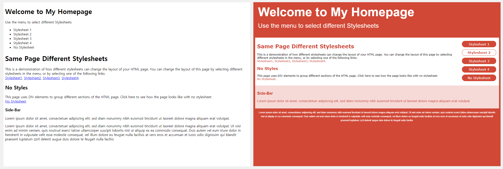
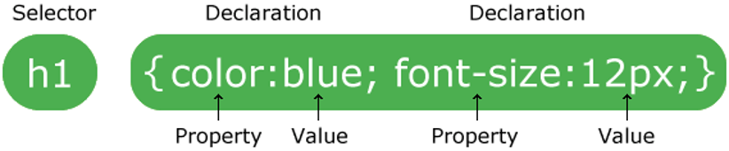
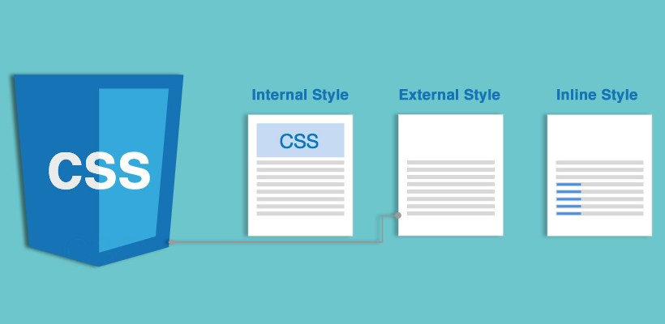

# [STS-10] 웹프로그래밍 :: 짧고 굵게 배우기

[![Dinfree][din-badge]][din-url]
[![Subject][basic-badge]][din-url]

[STS-10]은 웹프로그래밍의 핵심 개념에서 부터 주요 기술인 html, css, javascript를 비롯해 필수 응용 라이브러리인 bootstrap, jquery까지를 다루는 과정 입니다.

## CSS - 개념 이해
이부분은 해당 챕터에 대한 설명과 안내가 나와야 하는데 우선 이부분은 비워 두도록 한다. 이부분은 해당 챕터에 대한 설명과 안내가 나와야 하는데 우선 이부분은 비워 두도록 한다.이부분은 해당 챕터에 대한 설명과 안내가 나와야 하는데 우선 이부분은 비워 두도록 한다.이부분은 해당 챕터에 대한 설명과 안내가 나와야 하는데 우선 이부분은 비워 두도록 한다.이부분은 해당 챕터에 대한 설명과 안내가 나와야 하는데 우선 이부분은 비워 두도록 한다.

### 목차
1. CSS 소개
2. 사용 이유
3. 기본 문법
4. 포함 방법

---
## 1. CSS 소개

CSS(Cascading Style Sheets)는 HTML과 함께 웹 표준의 기본 개념입니다. HTML이 텍스트나 이미지, 표 같은 각 요소를 웹 문서에 넣어 뼈대를 만드는 것이라면 CSS는 텍스트 색상이나 크기, 이미지 크기나 위치, 표 색상, 배치 방법 등 웹 문서의 디자인 요소를 담당합니다.


<p></p>

- CSS란 `Cascading Style Sheet`의 약자로써, HTML 문서를 표현하는 방법을 기술하는 언어입니다.
- 웹 페이지의 `내용(HTML)`과 `스타일(CSS)`을 분리해주어 작업을 효율적으로 수행할 수 있도록 도와줍니다.
- CSS는 HTML문서를 디자인하는 언어입니다.

### 동영상 강좌
- 스타일과 스타일시트는 무엇인가?
  > https://bit.ly/2O7vd2z (00:00 ~ 03:14) <!-- 03:14-->
- CSS 소개: HTML과 CSS
  > https://bit.ly/2JKpUCC <!--15:21-->
- CSS 소개 및 기본 구조
  > https://bit.ly/2LBbiY1 (00:00 ~ 02:07) <!--02:07-->

 <!--20분 42초-->

### 참고 자료
- w3school - CSS 정의
  > https://bit.ly/2skLnhw 
- ofcourse - CSS 개요
  > https://bit.ly/2O7dgkA
- MDN web docs - How CSS works
  > https://mzl.la/2dggA9Q
- Tech Altum tutorial - 개요, Type
  > https://bit.ly/2nd67TT


### 퀴즈
#### 1) CSS는 무엇의 약자인가요?
<details>
<summary>해답보기</summary>
<p></p>
<div markdown="1">

> Cascading Style Sheet
</div>
</details>

#### 2) HTML에 CSS를 추가할 때, 웹 페이지에서 달라지는 점은 무엇입니까?
<details>
<summary>해답보기</summary>
<p></p>
<div markdown="1">

- 레이아웃
- 디자인
</div>
</details>

<br />

---
## 2. 사용 이유
내용과 디자인이 구분되어 있기 때문에 웹 페이지의 내용을 수정해야 할 때도 디자인에 전혀 영향을 미치지 않고 내용만 수정할 수 있습니다. 또한, 기존 HTML 문서는 웹 브라우저 화면을 기본으로 하기 때문에 각 기기에 맞는 브라우저에 적합하게 문서를 만들어야 했습니다. 하지만 CSS는 내용은 그대로 두고 대상 기기에 맞게 CSS만 바꾸어 주면 같은 내용을 여러 기기에 맞추어 볼 수 있습니다.


<p></p>

- 웹 문서의 내용과 상관없이 디자인만 바꿀 수 있습니다.
- 다양한 기기에 맞게 탄력적으로 바뀌는 문서를 만들 수 있습니다.
- 하나의 HTML파일와 여러 개의 CSS파일이 존재할 때, 다양한 디자인의 웹 페이지를 구성할 수 있습니다.


### 동영상 강좌
- CSS 목적 및 역사
  > https://bit.ly/2uODijQ (08:45 ~ 12:06) <!--03:21-->
- CSS 등장배경
  > https://bit.ly/2Lsa1Ga <!--10:44-->

 <!--14분 05초-->

### 참고 자료
- w3school - CSS 사용이유, 목적
  > https://bit.ly/2skLnhw 

### 퀴즈
#### 1) CSS를 사용하는 이유는 무엇입니까?
<details>
<summary>해답보기</summary>
<p></p>
<div markdown="1">

> 해상도가 다른 화면과 장치들의 웹 페이지에 레이아웃을 구성하고, 스타일을 입히기 위해서 
</div>
</details>

<br />

---
## 3. 기본 문법

CSS는 선택자와 선언부로 구성됩니다. 선택자는 스타일을 지정할 HTML 요소를 가리킵니다. 선언에는 CSS 속성 이름과 값이 포함됩니다. 속성이 여러 개일 경우, 한 줄로 나열해도 상관없지만 여러 줄에 걸쳐 작성하는 것이 좋습니다.


<p></p>

- CSS규칙은 `선택자(selector)`와 `선언부(declaration)`로 구성됩니다.
- 선택자는 사용자가 스타일하고자 하는 HTML요소를 가리킵니다.
- 선언부는 `콜론`으로 구분되어진 다수의 선언들을 포함합니다.
- 각 선언은 항상 `세미콜론`으로 끝나며, 선언블록은 `중괄호`로 묶습니다.
- `/* 주석 */`은 코드를 설명하는 데 사용되며 나중에 소스 코드를 편집할 때에도 도움이 됩니다.
- 주석은 브라우저에서는 표현되지 않습니다.
```css
/* 이것은 h1태그의 색상을 파랑색으로 만드는 CSS코드입니다. */
h1 { color: blue; }
```

### 동영상 강좌
- CSS 규칙
  > https://bit.ly/2uODijQ (12:08 ~ 20:20) <!--08:12-->
- 실시간 코딩을 통한 CSS 기본 문법 알아보기
  > https://bit.ly/2fbTQN5 <!--05:06-->
- 기본 문법에 따른 실습 강의
  > https://bit.ly/2AzKrKR (02:07 ~ 06:33) <!--04:26-->

 <!--17분 44초-->

### 참고 자료
- w3school - CSS 기본 문법
  > https://bit.ly/2skLnhw 
- ofcourse - CSS 사용법, 주석
  > https://bit.ly/2O7dgkA
- MDN web docs - CSS syntax
  > https://mzl.la/2LUDsRj


### 퀴즈
#### 1) h1 태그 색상을 초록색으로 설정하는 CSS코드를 쓰시오.
<details>
<summary>해답보기</summary>
<p></p>
<div markdown="1">

```css
h1 { color: green; }
```
</div>
</details>

#### 2) 1번 코드에 폰트가 'Gothic'인 스타일을 추가하시오.
<details>
<summary>해답보기</summary>
<p></p>
<div markdown="1">

```css
h1 {
    color: green;
    font-family: Gothic;
}
```
</div>
</details>

<br />

---
## 4. 포함 방법

CSS의 포함방법에는 `내부 스타일시트, 외부 스타일시트, 인라인 스타일` 총 3가지가 있습니다.


<p></p>

#### 1) 내부 스타일시트
```html
<style>
body {
    background-color: linen;
}

h1 {
    color: maroon;
    margin-left: 40px;
} 
</style>
```
#### 2) 외부 스타일시트
```html
<link rel="stylesheet" type="text/css" href="mystyle.css">
```
#### 3) 인라인 스타일
```html
<h1 style="color:blue;margin-left:30px;">This is a heading</h1>
```


### 동영상 강좌
- HTML과 CSS가 만나는 법
  > https://bit.ly/2mEZhGt <!--06:50-->
- HTML 문서와 CSS 연결 방법
  > https://bit.ly/2uODijQ (22:52 ~ 27:00) <!--04:08-->
- 내부 스타일시트, 외부 스타일시트, 인라인 스타일
  > https://bit.ly/2LDZG6K (05:15 ~ 09:43) <!--04:28-->
- 외부 스타일시트 실습 강의
  > https://bit.ly/2O7eNHm <!--05:02-->
- CSS 재사용
  > https://bit.ly/2NxvIlm <!--05:03-->

<!--25분 31초-->


### 참고 자료
- w3school - CSS How To
  > https://bit.ly/2rTn9e9 
- CSSTutorial - 외부스타일시트
  > https://bit.ly/2O9ngd5 
- MDN web docs - How to apply CSS to HTML
  > https://mzl.la/2dggA9Q

### 퀴즈
#### 1) CSS포함방법 3가지를 쓰시오.
<details>
<summary>해답보기</summary>
<p></p>
<div markdown="1">

- 내부 스타일시트
- 외부 스타일시트
- 인라인스타일

</div>

</details>

#### 2) 외부 스타일시트의 장점은 무엇입니까?
<details>
<summary>해답보기</summary>
<p></p>
<div markdown="1">

> 외부 스타일 시트를 사용하면 하나의 파일만 변경하여 전체 웹 사이트의 모양을 변경할 수 있습니다.
</div>
</details>

<!-- 1:18:02-->
 

[din-badge]:https://img.shields.io/badge/dinfree-edu-orange.svg
[din-url]:https://github.com/dinfree
[basic-badge]:https://img.shields.io/badge/core-basic-green.svg