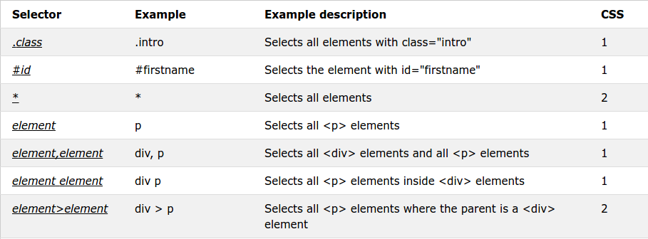

# [STS-10] 웹프로그래밍 :: 짧고 굵게 배우기

[![Dinfree][din-badge]][din-url]
[![Subject][basic-badge]][din-url]

[STS-10]은 웹프로그래밍의 핵심 개념에서 부터 주요 기술인 html, css, javascript를 비롯해 필수 응용 라이브러리인 bootstrap, jquery까지를 다루는 과정 입니다.

## CSS 선택자와 색상
이부분은 해당 챕터에 대한 설명과 안내가 나와야 하는데 우선 이부분은 비워 두도록 한다. 이부분은 해당 챕터에 대한 설명과 안내가 나와야 하는데 우선 이부분은 비워 두도록 한다.이부분은 해당 챕터에 대한 설명과 안내가 나와야 하는데 우선 이부분은 비워 두도록 한다.이부분은 해당 챕터에 대한 설명과 안내가 나와야 하는데 우선 이부분은 비워 두도록 한다.이부분은 해당 챕터에 대한 설명과 안내가 나와야 하는데 우선 이부분은 비워 두도록 한다.

### 목차
1. 선택자 개요
2. 기본 선택자 - 태그, 아이디, 클래스
3. 색상 - 폰트, 배경

---
## 1. 선택자 개요

소제목에 대한 간단한 설명이 와야 합니다. 최대한 간결하게 해당 소제목의 내용중 핵심을 설명합니다. 설명과 함께 목록등이 올 수 있으며 반드시 하나 이상의 이미지와 설명이 있어야 합니다. 단, 내용이 너무 길어지지 않도록 작성 합니다.


<p></p>

- 선택자는 어떤 요소들에 <strong>`스타일 효과`</strong>를 주는 언어입니다.
- 그 요소들의 종류에 따라 태그, 아이디, 클래스 선택자로 나뉩니다.

### 동영상 강좌
- 선택자와 선언
  > https://bit.ly/2uQRb0Y <!-- 7:39 -->
- 선택자의 개요
  > https://bit.ly/2uOH9NQ (00:00 ~ 13:12) <!-- 13:12 --> 

 <!-- 20:51 -->

### 참고 자료
- ofcourse - 선택자 개요, 종류
  > https://bit.ly/2mz8boz
- w3school - Selector Reference
  > https://bit.ly/2mMWokL 
- MDN web docs - 선택자 소개
  > https://mzl.la/2xr20dc


### 퀴즈
#### 1) h1 { color: red; } 코드에서 선택자는 무엇입니까?
<details>
<summary>해답보기</summary>
<p></p>
<div markdown="1">

```
h1
```
</div>

</details>

<br />

---
## 2. 기본 선택자 - 태그, 아이디, 클래스

소제목에 대한 간단한 설명이 와야 합니다. 최대한 간결하게 해당 소제목의 내용중 핵심을 설명합니다. 설명과 함께 목록등이 올 수 있으며 반드시 하나 이상의 이미지와 설명이 있어야 합니다. 단, 내용이 너무 길어지지 않도록 작성 합니다.


<p></p>

- 선택자는 어떤 요소들에 <strong>`스타일 효과`</strong>를 주는 언어입니다.
- 그 요소들의 종류에 따라 태그, 아이디, 클래스 선택자로 나뉩니다.

### 동영상 강좌
- 태그선택자와 전체선택자
  > https://bit.ly/2OArR8q (13:13 ~ 30:14) <!-- 17:01 -->
- id선택자와 class선택자 그리고 선택자 응용
  > https://bit.ly/2v1UP8v (00:00 ~ 27:24) <!-- 27:24 -->
- 아이디 선택자
  > https://bit.ly/2LsH4da <!-- 06:30 -->
- 클래스 선택자
  > https://bit.ly/2uEXFka <!-- 06:44 -->
- 주요선택자(전체,태그,클래스,아이디)
  > https://bit.ly/2OFFbIB (09:44 ~ 14:39) <!-- 4:55 -->
- 코딩을 통한 아이디 선택자
  > https://bit.ly/2LYIw75 <!-- 04:39 -->
- 코딩을 통한 클래스 선택자
  > https://bit.ly/2LLTNZb <!-- 04:09 -->
- 다중 클래스 선택자
  > https://bit.ly/2ABbTYH <!-- 03:28 -->
- 실시간 코딩을 통한 아이디 선택자
  > https://bit.ly/2l1hLhX <!-- 04:24 -->
- 실시간 코딩을 통한 클래스 선택자
  > https://bit.ly/2kSraHu <!-- 03:59 -->

 <!-- 1:23:13 -->

### 참고 자료
- ofcourse - 태그, id, class 선택자
  > https://bit.ly/2ADgvh4
- MDN web docs - 기본 선택자
  > https://mzl.la/2n6zHdr
- Tech Altum Tutorial - 선택자
  > https://bit.ly/2LRHaMw


### 퀴즈
#### 1) 선택자 종류 3가지를 쓰고, 각각의 표현을 쓰시오.
<details>
<summary>해답보기</summary>
<p></p>
<div markdown="1">

```css
1. 태그 
h1 { color: red; }

2. 아이디
#id { color: red; }

3. 클래스
.class { color: red; }
```
</div>

</details>

#### 2) `<h1 class="box">Hello world</h1>` "Hello world"의 폰트 색상을 빨강색으로 설정하는 2가지 방법을 모두 쓰시오.
<details>
<summary>해답보기</summary>
<p></p>
<div markdown="1">

```css
.box { color: red; }
h1 { color: red; }
```
</div>

</details>

<br />

---
## 3. 색상 - 폰트, 배경

소제목에 대한 간단한 설명이 와야 합니다. 최대한 간결하게 해당 소제목의 내용중 핵심을 설명합니다. 설명과 함께 목록등이 올 수 있으며 반드시 하나 이상의 이미지와 설명이 있어야 합니다. 단, 내용이 너무 길어지지 않도록 작성 합니다.


<p></p>

- CSS에서 Color 속성은 색상이름, HEX(#)코드, RGB코드로 나타낼 수 있습니다.
- RGBA는 색상에 투명도를 적용시킬 때 사용합니다.

### 동영상 강좌
- Color 속성
  > https://bit.ly/2O6RYUo <!-- 09:18 -->
- Web Colors
  > https://bit.ly/2LPHI5p <!-- 05:14 -->
- Background 속성
  > https://bit.ly/2uEQHvH <!-- 13:48 -->
- 배경 이미지
  > https://bit.ly/2n7rCFz <!-- 02:01 -->
- 색상표현방법과 배경설정
  > https://bit.ly/2LKZ2sd <!-- 17:16 -->

 <!-- 47:37 -->

### 참고 자료
- ofcourse - 색상, 배경
  > https://bit.ly/2uX48pU   
  > https://bit.ly/2n9y7Ym
- w3school - 색상, 배경
  > https://bit.ly/2JIvu8P
- Tech Altum Tutorial - 색상, 배경
  > https://bit.ly/2Mf1LGo   
  > https://bit.ly/2OHaz9Y


### 퀴즈
#### 1) CSS color 표현방법 3가지를 쓰시오.
<details>
<summary>해답보기</summary>
<p></p>
<div markdown="1">

- color name
- HEX code
- RGB code
</div>

</details>

#### 2) background에 image 설정하는 코드를 작성하시오. (image01.png)
<details>
<summary>해답보기</summary>
<p></p>
<div markdown="1">

```css
{ background-image: url("image01.png"); }
```
</div>

</details>

<!-- 2:31:41 -->

[din-badge]:https://img.shields.io/badge/dinfree-edu-orange.svg
[din-url]:https://github.com/dinfree
[basic-badge]:https://img.shields.io/badge/core-basic-green.svg