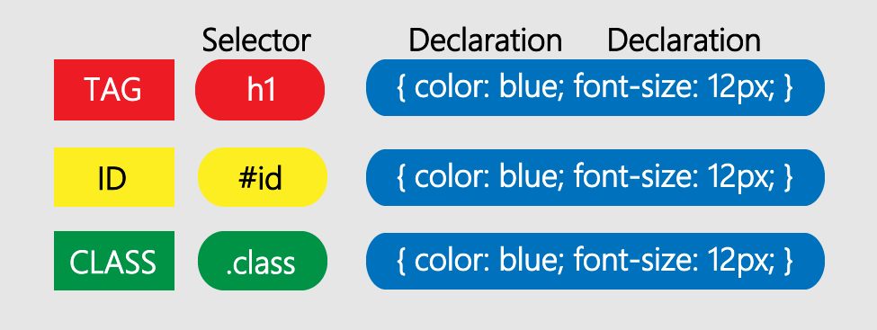
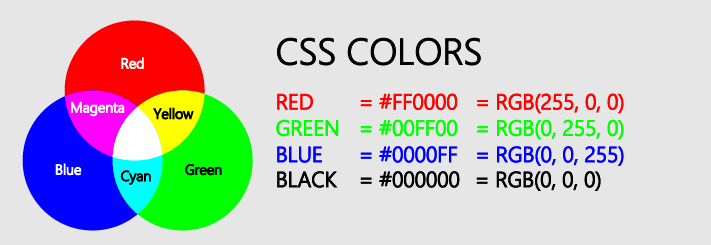

# [STS-10] 웹프로그래밍 :: 짧고 굵게 배우기

[![Dinfree][din-badge]][din-url]
[![Subject][basic-badge]][din-url]

[STS-10]은 웹프로그래밍의 핵심 개념에서 부터 주요 기술인 html, css, javascript를 비롯해 필수 응용 라이브러리인 bootstrap, jquery까지를 다루는 과정 입니다.

## CSS - 선택자와 색상
스타일 시트의 가장 기본적인 내용인 선택자를 다룹니다. 기본 선택자에는 어떠한 것이 있는지 살펴본 후 각각의 선택자를 비교해봅니다. 각각의 선택자마다 HTML 요소에 접근하는 방법이 어떻게 다른지 차이점에 대해 알아봅니다. CSS 색상을 표현하는 방법들을 배웁니다. 표현 방법의 원리에 대해 학습하고 같은 색상을 각각의 색상코드로 어떻게 나타내는지 연습해봅니다.

### 목차
1. [선택자 개요](#m1)
2. [기본 선택자](#m2)
3. [색상](#m3)

---
<a id="m1"></a>

## 1. 선택자 개요

스타일은 적용 대상이 있어야 하는데 선택자가 바로 그 대상입니다. 선택자는 기존에 HTML 문서에서 사용되는 태그에 대해서 속성과 값을 정의하는 방식으로 별도의 적용 코드 없이 선언과 동시에 해당 태그에 스타일이 적용됩니다. 스타일을 선언할 때 주의사항은 HTML에서 기존에 사용하던 태그만 사용가능하다는 점입니다.

| Selector | Example | Example description |
|---------|--------|--------------------|
| .class | .intro | Selects all elements with class="intro" |
| #id | #firstname | Selects the element with if="firstname" |
| * | * | Selects all elements |
| element | p | Select all \<p> elements |
| element, element | div, p | Selects all \<div> elements and all \<p> elements |
| element  element | div p | Selects all \<p> elements inside \<div> elements |
| element > element | div > p | Selects all \<p> elements where the parent is a \<div> element |

- CSS가 어떤 태그에 스타일을 정의할 때, 어떤 태그에 정의할 지에 대한 문법이 필요하게 되는데 그것을 선택자라고 합니다.
- 선택자는 HTML 요소를 요소 이름, 아이디, 클래스, 특성 등에 따라 찾을 때 사용됩니다.

### 동영상 강좌
- 선택자와 선언 : [https://bit.ly/2uQRb0Y](https://bit.ly/2uQRb0Y){:target="_blank"} `7:39`
- 선택자의 개요 : [https://bit.ly/2uOH9NQ](https://bit.ly/2uOH9NQ){:target="_blank"} (00:00 ~ 13:12) `13:12` 

 <!-- 20:51 -->

### 참고 자료
- 선택자 개요, 종류 : [https://bit.ly/2mz8boz](https://bit.ly/2mz8boz){:target="_blank"}
- Selector Reference : [https://bit.ly/2mMWokL](https://bit.ly/2mMWokL){:target="_blank"} 
- 선택자 소개 : [https://mzl.la/2xr20dc](https://mzl.la/2xr20dc){:target="_blank"}


### 퀴즈
#### 1) 선택자의 개념을 쓰시오.
<details>
<summary>해답보기</summary>
<p></p>
<div markdown="1">

> CSS가 어떤 태그에 스타일을 정의할 때, 어떤 태그에 정의할 지에 대한 문법이 필요하게 되는데 그것을 선택자라고 합니다.
</div>
</details>

#### 2) 다음 코드에서 선택자는 무엇입니까?
```css
h1 { color: red; }
```
<details>
<summary>해답보기</summary>
<p></p>
<div markdown="1">

- h1

</div>
</details>

<br />

---
<a id="m2"></a>

## 2. 기본 선택자

기본 선택자에는 `태그, 아이디, 클래스` 3가지가 있습니다.


<p></p>

#### 1) 태그 선택자
- 태그 선택자는 `태그 이름`으로 요소를 선택합니다.
- 다수의 선택자들은 `그룹핑`하여 적용할 수 있습니다.
```css
h1,h2,h3,h4 { color: blue; }
```

#### 2) 아이디 선택자
- HTML 요소의 `아이디 속성`을 사용하여 특정 요소를 선택합니다.
- 요소의 아이디는 페이지 내에서 고유해야 하므로 아이디 선택자는 `하나의 고유한 요소를 선택`하는 데 사용됩니다.
```css
#id_name { color: blue; }
```

#### 3) 클래스 선택자
- 클래스 선택자는 `특정 클래스 속성`이 있는 요소를 선택합니다.
- 특정 클래스를 선택할 때에는 `마침표(.) 다음에 클래스 이름`을 씁니다.
- 특정 HTML 요소만 클래스의 영향을 받도록 지정할 수 있습니다.
```css
.class_name1 { color: blue; }
p.class_name2 { color: red; }
```

### 동영상 강좌
- 태그선택자와 전체선택자 : [https://bit.ly/2OArR8q](https://bit.ly/2OArR8q){:target="_blank"} (13:13 ~ 30:14) `17:01`
- id선택자와 class선택자 그리고 선택자 응용 : [https://bit.ly/2v1UP8v](https://bit.ly/2v1UP8v){:target="_blank"} (00:00 ~ 27:24) `27:24`
- 아이디 선택자 : [https://bit.ly/2LsH4da](https://bit.ly/2LsH4da){:target="_blank"} `06:30`
- 클래스 선택자 : [https://bit.ly/2uEXFka](https://bit.ly/2uEXFka){:target="_blank"} `06:44`
- 주요선택자(전체,태그,클래스,아이디) : [https://bit.ly/2OFFbIB](https://bit.ly/2OFFbIB){:target="_blank"} (09:44 ~ 14:39) `4:55`
- 코딩을 통한 아이디 선택자 : [https://bit.ly/2LYIw75](https://bit.ly/2LYIw75){:target="_blank"} `04:39`
- 코딩을 통한 클래스 선택자 : [https://bit.ly/2LLTNZb](https://bit.ly/2LLTNZb){:target="_blank"} `04:09`
- 다중 클래스 선택자 : [https://bit.ly/2ABbTYH](https://bit.ly/2ABbTYH){:target="_blank"} `03:28`
- 실시간 코딩을 통한 아이디 선택자 : [https://bit.ly/2l1hLhX](https://bit.ly/2l1hLhX){:target="_blank"} `04:24`
- 실시간 코딩을 통한 클래스 선택자 : [https://bit.ly/2kSraHu](https://bit.ly/2kSraHu){:target="_blank"} `03:59`

 <!-- 1:23:13 -->

### 참고 자료
- 태그, id, class 선택자 : [https://bit.ly/2ADgvh4](https://bit.ly/2ADgvh4){:target="_blank"}
- 기본 선택자 : [https://mzl.la/2n6zHdr](https://mzl.la/2n6zHdr){:target="_blank"}
- 선택자 : [https://bit.ly/2LRHaMw](https://bit.ly/2LRHaMw){:target="_blank"}


### 퀴즈
#### 1) 선택자 종류 3가지를 쓰고, 각각의 표현을 쓰시오.
<details>
<summary>해답보기</summary>
<p></p>
<div markdown="1">

```css
1. 태그 
h1 { color: red; }

2. 아이디
#id { color: red; }

3. 클래스
.class { color: red; }
```
</div>
</details>

#### 2) 다음 코드의 폰트 색상을 빨강색으로 설정하는 2가지 방법을 모두 쓰시오.
```html
<h1 class="box">Hello world</h1>
```
<details>
<summary>해답보기</summary>
<p></p>
<div markdown="1">

```css
.box { color: red; }
h1 { color: red; }
```
</div>
</details>

<br />

---
<a id="m3"></a>

## 3. 색상
컴퓨터에서 사용하는 색상은 빛의 삼원색인 빨강색(Red), 초록색(Green), 파랑색(Blue)입니다. 이를 보통 RGB Color라고 부르는데, 각각의 색상은 0 ~ 255까지의 단계로 표현할 수 있습니다. 0부터 255를 16진수로 표현하면 00 ~ FF로 표현됩니다. CSS는 140개 이상의 `색상이름, 16진수(HEX) 값, RGB 값 , RGBA 값, 불투명도`를 지원합니다.


<p></p>

- CSS에서 Color속성은 `색상이름, HEX(#)코드, RGB코드`로 나타낼 수 있습니다.
- `RGBA는 색상에 투명도를 적용`시킬 때 사용하며, 0~1 사이의 숫자로 나타냅니다.
- CSS 배경속성에는 배경색, 이미지, 배경반복 등이 있습니다.

#### 1) CSS Color
```css
#text1 { color: red; }
#text2 { color: #FF0000; }
#text3 { color: rgb(255, 0, 0); }
```
#### 2) CSS Background-color
```css
#box { 
  background-color: green;
  background-image: url("/img/img.png"); 
  background-repeat: repeat-x;
}
```

### 동영상 강좌
- Color 속성 : [https://bit.ly/2O6RYUo](https://bit.ly/2O6RYUo){:target="_blank"} `09:18`
- Web Colors : [https://bit.ly/2LPHI5p](https://bit.ly/2LPHI5p){:target="_blank"} `05:14`
- Background 속성 : [https://bit.ly/2uEQHvH](https://bit.ly/2uEQHvH){:target="_blank"} `13:48`
- 배경 이미지 : [https://bit.ly/2n7rCFz](https://bit.ly/2n7rCFz){:target="_blank"} `02:01`
- 색상표현방법과 배경설정 : [https://bit.ly/2LKZ2sd](https://bit.ly/2LKZ2sd){:target="_blank"} `17:16`

 <!-- 47:37 -->

### 참고 자료
- 색상 : [https://bit.ly/2uX48pU](https://bit.ly/2uX48pU){:target="_blank"}   
- 배경 : [https://bit.ly/2n9y7Ym](https://bit.ly/2n9y7Ym){:target="_blank"}
- 색상, 배경 : [https://bit.ly/2JIvu8P](https://bit.ly/2JIvu8P){:target="_blank"}
- 색상 : [https://bit.ly/2Mf1LGo](https://bit.ly/2Mf1LGo){:target="_blank"}   
- 배경 : [https://bit.ly/2OHaz9Y](https://bit.ly/2OHaz9Y){:target="_blank"}


### 퀴즈
#### 1) CSS color 표현방법 3가지를 쓰시오.
<details>
<summary>해답보기</summary>
<p></p>
<div markdown="1">

- 색상 이름
- HEX code
- RGB code
</div>
</details>

#### 2) 배경에 이미지를 설정하는 코드를 작성하시오. (image01.png)
<details>
<summary>해답보기</summary>
<p></p>
<div markdown="1">

```css
{ background-image: url("image01.png"); }
```
</div>
</details>

<!-- 2:31:41 -->


[din-badge]:https://img.shields.io/badge/dinfree-edu-orange.svg
[din-url]:https://github.com/dinfree
[basic-badge]:https://img.shields.io/badge/core-basic-green.svg