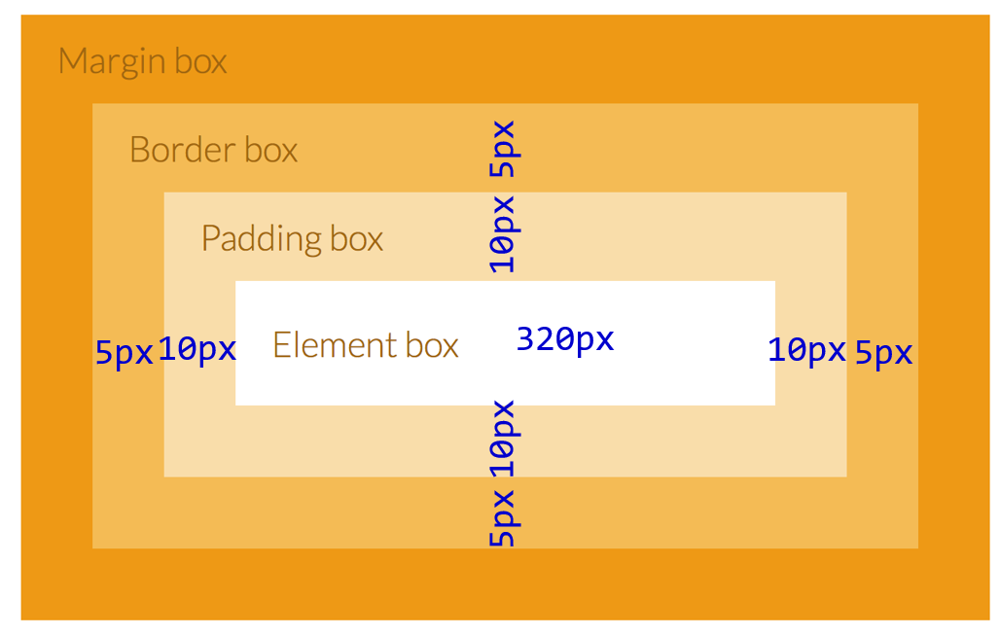
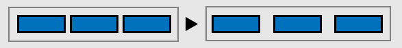

# [STS-10] 웹프로그래밍 :: 짧고 굵게 배우기

[![Dinfree][din-badge]][din-url]
[![Subject][basic-badge]][din-url]

[STS-10]은 웹프로그래밍의 핵심 개념에서 부터 주요 기술인 html, css, javascript를 비롯해 필수 응용 라이브러리인 bootstrap, jquery까지를 다루는 과정 입니다.

## CSS - 박스 모델
스타일 속성을 적용하려면 먼저 스타일 값으로 입력할 수 있는 CSS 단위부터 알아야 합니다. 스타일 값으로 입력할 수 있는 단위를 절대 단위와 상대 단위로 나누어 살펴봅니다. 박스 모델은 웹 페이지의 레이아웃을 구성할 때 매우 중요한 개념입니다. 박스 모델의 개념을 이해하고 width, height, border, padding, margin으로 나뉜 각 속성의 사용법과 차이점을 알아봅니다. 

### 목차
1. [CSS 단위](#m1)
2. [박스 모델](#m2)

---
<a id="m1"></a>

## 1. CSS 단위
CSS에는 길이 표현을 위한 여러 단위가 있습니다. 많은 CSS 속성은 width, margin, padding과 같은 길이 값을 사용합니다. 길이는 10px, 2em과 같은 길이 단위가 뒤에 오는 숫자입니다. 길이 단위에는 절대 단위와 상대 단위의 두 가지 유형이 있습니다.

#### 1) 절대 단위

| Unit | Description |
|------|-------------|
| cm | centimeters |
| mm | millimeters |
| in | inches (1in = 96px = 2.54cm) |
| px * | pixels (1px = 1/96th of 1in) |
| pt | points (1pt = 1/72 of 1in) |
| pc | picas (1pc = 12pt) | 

- 브라우저에서 지정한 글자 크기로, 값이 고정되어 있습니다.
- px : 픽셀. 모니터에 따라 상대적 크기가 됩니다.
- pt : 포인트. 일반 문서에서 많이 사용하는 단위입니다.

#### 2) 상대 단위

| Unit | Description |
|------|-------------|
| em | Relative to the font-size of the element (2em means 2times the size of the current font) |
| ex | Relative to the x-height of the current font (rarely used) |
| ch | Relative to width of the "0" (zero) |
| rem | Relative to font-size of the root element |
| vw | Relative to 1% of the width of the viewport* |
| vh | Relative to 1% of the height of the viewport* |
| vmin | Relative to 1% of viewport's* smaller dimension |
| vmax | Relative to 1% of viewport's* larger dimension |
| % | |

- 상대 단위는 부모요소의 글자 크기를 기준으로 크기가 정해집니다.
- em : 해당 글꼴의 대문자 M의 너비를 기준으로 크기를 조절합니다.
- ex : 해당 글꼴의 소문자 x의 높이를 기준으로 크기를 조절합니다.
- rem : rem에서 r은 루트(root)를 뜻하며, 처음부터 기본크기를 지정하기 때문에 중간에 기본값이 바뀌지 않습니다.

### 동영상 강좌
- 폰트 사이즈 : [https://bit.ly/2M4CuSN](https://bit.ly/2M4CuSN){:target="_blank"} (05:51 ~ 09:16) `03:25`
- CSS 길이와 단위 : [https://bit.ly/2my1JhH](https://bit.ly/2my1JhH){:target="_blank"} (19:05 ~ 22:55) `03:50`
- 다양한 폰트 사이즈 : [https://bit.ly/2Kp4HP1](https://bit.ly/2Kp4HP1){:target="_blank"} `05:26`
- 실시간 코딩을 통한 폰트사이즈 특성 : [https://bit.ly/2ACJcdZ](https://bit.ly/2ACJcdZ){:target="_blank"} `02:59`

 <!-- 15:40 -->

### 참고 자료
- CSS 단위 : [https://bit.ly/2LEEc9R](https://bit.ly/2LEEc9R){:target="_blank"}
- CSS Units Tutorial : [https://bit.ly/2Km5Jvn](https://bit.ly/2Km5Jvn){:target="_blank"}  

### 퀴즈
#### 1) 절대크기와 상대크기 단위 각각 2가지씩 쓰시오.
<details>
<summary>해답보기</summary>
<p></p>
<div markdown="1">

- 절대크기: cm, mm, in, px, pt
- 상대크기: em, ex, ch, rem, %
</div>
</details>

#### 2) 절대단위와 상대단위의 차이점이 무엇입니까?
<details>
<summary>해답보기</summary>
<p></p>
<div markdown="1">

> 절대 단위는 크기가 고정되어 있으나, 상대단위는 부모요소에 따라 크기가 변경된다.
</div>
</details>

<br />

---
<a id="m2"></a>

## 2. 박스 모델

대부분의 HTML 태그는 박스 모델로 표현됩니다. 단락을 생성하는 \<p>, \<div> 태그, 이미지를 삽입하는 \태그 모두 박스 모델의 형태로 문서에 포함됩니다. 이들이 박스 모델인 이유는 문서에 삽입되는 영역이 하나의 박스처럼 보이기 때문입니다. 박스 모델은 테두리(border)와 내용(content) 그리고 안쪽 여백(padding)과 바깥쪽 여백(margin)의 네 가지 요소로 구성됩니다. 각 영역은 상, 하, 좌, 우 네 가지 영역으로 구분됩니다. 



- Element 박스 - 텍스트 및 이미지가 나타나는 상자 내용입니다.
- Padding 박스 - Element 박스를 둘러싼 눈에 보이지 않는 영역입니다.
- Border 박스 - Element와 Padding 박스를 둘러싼 경계선입니다.
- Margin 박스 - Border 박스 외부를 둘러싼 눈에 보이지 않는 영역입니다.
```css
div {
  width: 320px;
  padding: 10px;
  border: 5px solid gray;
  margin: 0;
}
```


### 동영상 강좌
- 박스모델 개념 : [https://bit.ly/2zWgLaL](https://bit.ly/2zWgLaL){:target="_blank"}  `08:57`
- 박스모델을 사용해야 되는 이유와 개념 : [https://bit.ly/2mze19t](https://bit.ly/2mze19t){:target="_blank"} `16:20`
- 박스모델 응용 : [https://bit.ly/2NuVGpu](https://bit.ly/2NuVGpu){:target="_blank"} `06:24`
- 박스모델 소개 : [https://bit.ly/2vf3YLM](https://bit.ly/2vf3YLM){:target="_blank"} (00:00 ~ 03:50) `03:50`
- 박스모델의 각각의 속성들 : [https://bit.ly/2LMjrx0](https://bit.ly/2LMjrx0){:target="_blank"} `06:18`
- Margin과 Padding 응용 : [https://bit.ly/2OEZg1K](https://bit.ly/2OEZg1K){:target="_blank"} `05:25`
- 각 속성들의 top, right, bottom, left 속성 : [https://bit.ly/2MfJ71g](https://bit.ly/2MfJ71g){:target="_blank"} `04:45`

 <!-- 51:59 -->

### 참고 자료
- Box Model, Border, Margin, Padding, Height/Width : [https://bit.ly/2stLx30](https://bit.ly/2stLx30){:target="_blank"}
- CSS Box Model : [https://bit.ly/2O90am9](https://bit.ly/2O90am9){:target="_blank"} 
- Box Model : [https://bit.ly/2BUB0Gf](https://bit.ly/2BUB0Gf){:target="_blank"}


### 퀴즈
#### 1) Margin과 Padding 의 영역이 어느 곳인지 쓰시오.
<details>
<summary>해답보기</summary>
<p></p>
<div markdown="1">

> Margin은 border 바깥쪽을 둘러싼 영역이고, Padding은 content를 둘러싼 영역입니다.
</div>
</details>

#### 2) 다음 그림에서 오른쪽과 같이 배치하려면 어떤 속성의 값을 변경해야 합니까?

<p></p>
<details>
<summary>해답보기</summary>
<p></p>
<div markdown="1">

- Margin
</div>
</details>

<!-- 1:07:39 -->


[din-badge]:https://img.shields.io/badge/dinfree-edu-orange.svg
[din-url]:https://github.com/dinfree
[basic-badge]:https://img.shields.io/badge/core-basic-green.svg