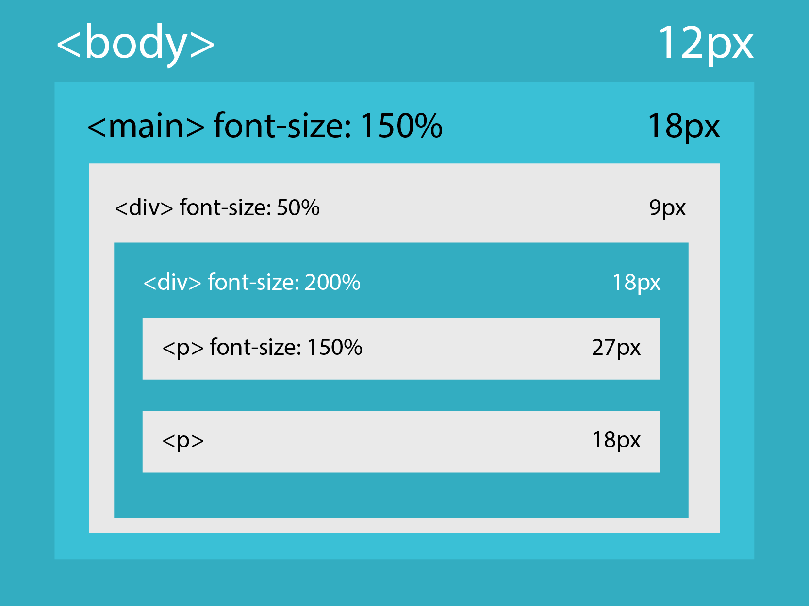

# [STS-10] 웹프로그래밍 :: 짧고 굵게 배우기

[![Dinfree][din-badge]][din-url]
[![Subject][basic-badge]][din-url]

[STS-10]은 웹프로그래밍의 핵심 개념에서 부터 주요 기술인 html, css, javascript를 비롯해 필수 응용 라이브러리인 bootstrap, jquery까지를 다루는 과정 입니다.

## CSS - Box Model
이부분은 해당 챕터에 대한 설명과 안내가 나와야 하는데 우선 이부분은 비워 두도록 한다. 이부분은 해당 챕터에 대한 설명과 안내가 나와야 하는데 우선 이부분은 비워 두도록 한다.이부분은 해당 챕터에 대한 설명과 안내가 나와야 하는데 우선 이부분은 비워 두도록 한다.이부분은 해당 챕터에 대한 설명과 안내가 나와야 하는데 우선 이부분은 비워 두도록 한다.이부분은 해당 챕터에 대한 설명과 안내가 나와야 하는데 우선 이부분은 비워 두도록 한다.

### 목차
1. CSS 단위
2. Box Model    
\- Margin, Border, Padding, Height/Width

---
## 1. CSS 단위

소제목에 대한 간단한 설명이 와야 합니다. 최대한 간결하게 해당 소제목의 내용중 핵심을 설명합니다. 설명과 함께 목록등이 올 수 있으며 반드시 하나 이상의 이미지와 설명이 있어야 합니다. 단, 내용이 너무 길어지지 않도록 작성 합니다.


<p></p>

- CSS단위에는 Absolute Units와 Relative Units가 있습니다.
- Absolute Units는 크기가 고정된 단위이고, Relative Units는 부모요소를 기준으로 크기가 정해집니다.

### 동영상 강좌
- 폰트 사이즈
  > https://bit.ly/2M4CuSN (05:51 ~ 09:16) <!-- 03:25 -->
- CSS 길이와 단위
  > https://bit.ly/2my1JhH (19:05 ~ 22:55) <!-- 03:50 -->
- 다양한 폰트 사이즈
  > https://bit.ly/2Kp4HP1 <!-- 05:26 -->
- 실시간 코딩을 통한 폰트사이즈 특성
  > https://bit.ly/2ACJcdZ <!-- 02:59 -->

 <!-- 15:40 -->

### 참고 자료
- w3school - CSS 단위
  > https://bit.ly/2LEEc9R
- WebNots - CSS Units Tutorial
  > https://bit.ly/2Km5Jvn  


### 퀴즈
#### 1) 절대크기와 상대크기 단위 각각 2가지씩 쓰시오.
<details>
<summary>해답보기</summary>
<p></p>
<div markdown="1">

- 절대크기: cm, mm, in, px, pt
- 상대크기: em, ex, ch, rem, %
</div>

</details>

---
#### 2) 절대크기와 상대크기의 차이점이 무엇입니까?
<details>
<summary>해답보기</summary>
<p></p>
<div markdown="1">

```
ㅁㅁㄻㄴㅇㄻㄹ
```
</div>

</details>

<br />

---
## 2. Box model
### - Margin, Border, Padding, Height/Width

소제목에 대한 간단한 설명이 와야 합니다. 최대한 간결하게 해당 소제목의 내용중 핵심을 설명합니다. 설명과 함께 목록등이 올 수 있으며 반드시 하나 이상의 이미지와 설명이 있어야 합니다. 단, 내용이 너무 길어지지 않도록 작성 합니다.


<p></p>

- Box Model에는 Margin, Border, Padding, Height/Width 가 있습니다.
- <strong>Content Box</strong> - 이 박스의 길이와 너비가 Height/Width가 되며, 이 안에 Text와 Image가 들어갑니다.
- <strong>Padding Box</strong> - Content Box를 둘러싼 눈에 보이지 않는 영역입니다.
- <strong>Border Box</strong> - Content와 Padding Box를 둘러싼 경계선입니다.
- <strong>Margin Box</strong> - Border Box 외부를 둘러싼 눈에 보이지 않는 영역입니다.

### 동영상 강좌
- 박스모델 개념
  > https://bit.ly/2zWgLaL <!-- 08:57 -->
- 박스모델을 사용해야 되는 이유와 개념
  > https://bit.ly/2mze19t <!-- 16:20 -->
- 박스모델 응용
  > https://bit.ly/2NuVGpu <!-- 06:24 -->
- 박스모델 소개
  > https://bit.ly/2vf3YLM (00:00 ~ 03:50) <!-- 03:50 -->
- 박스모델의 각각의 속성들
  > https://bit.ly/2LMjrx0 <!-- 06:18 -->
- Margin과 Padding 응용
  > https://bit.ly/2OEZg1K <!-- 05:25 -->
- 각 속성들의 top, right, bottom, left 속성
  > https://bit.ly/2MfJ71g <!-- 04:45 -->

 <!-- 51:59 -->

### 참고 자료
- w3school - Box Model, Border, Margin, Padding, Height/Width
  > https://bit.ly/2stLx30
- Tech Altum Tutorial - CSS Box Model
  > https://bit.ly/2O90am9 
- W3 - 8. Box Model
  > https://bit.ly/2BUB0Gf


### 퀴즈
#### 1) Margin과 Padding 의 영역이 어느 곳인지 쓰시오.
<details>
<summary>해답보기</summary>
<p></p>
<div markdown="1">

```
Margin은 border 바깥쪽을 둘러싼 영역이고, Padding은 content를 둘러싼 영역입니다.
```
</div>

</details>

#### 2) 다음 그림에서 오른쪽과 같이 배치하려면 어떤 속성의 값을 변경해야 합니까?

<p></p>
<details>
<summary>해답보기</summary>
<p></p>
<div markdown="1">

- Margin
</div>

</details>

<!-- 1:07:39 -->

[din-badge]:https://img.shields.io/badge/dinfree-edu-orange.svg
[din-url]:https://github.com/dinfree
[basic-badge]:https://img.shields.io/badge/core-basic-green.svg
