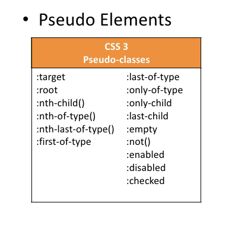

# [STS-10] 웹프로그래밍 :: 짧고 굵게 배우기

[![Dinfree][din-badge]][din-url]
[![Subject][basic-badge]][din-url]

[STS-10]은 웹프로그래밍의 핵심 개념에서 부터 주요 기술인 html, css, javascript를 비롯해 필수 응용 라이브러리인 bootstrap, jquery까지를 다루는 과정 입니다.

## CSS - 복합 선택자
이부분은 해당 챕터에 대한 설명과 안내가 나와야 하는데 우선 이부분은 비워 두도록 한다. 이부분은 해당 챕터에 대한 설명과 안내가 나와야 하는데 우선 이부분은 비워 두도록 한다.이부분은 해당 챕터에 대한 설명과 안내가 나와야 하는데 우선 이부분은 비워 두도록 한다.이부분은 해당 챕터에 대한 설명과 안내가 나와야 하는데 우선 이부분은 비워 두도록 한다.이부분은 해당 챕터에 대한 설명과 안내가 나와야 하는데 우선 이부분은 비워 두도록 한다.

### 목차
1. 상속
2. 부모 자식 선택자  
3. 가상클래스 선택자


---
## 1. 상속

CSS는 선택자 외에 상속이라는 개념으로 좀 더 효율적으로 속성을 적용시킬 수 있습니다. 계층구조에서 부모 요소와 자식 요소 사이에 속성을 물려받는 것을 상속이라고 합니다.


<p></p>

- 상속은 부모 엘리먼트의 속성을 자식 엘리먼트가 물려받는 것을 의미합니다. 
- 상속을 이용하면 CSS에서 생산성을 높일 수 있습니다. 

### 동영상 강좌
- 상속의 개념
  > https://bit.ly/2O4dQ1N <!-- 09:23 -->
- 코드를 이용한 상속의 개념
  > https://bit.ly/2AEEPPK <!-- 01:21 -->
- 상속과 오버라이딩
  > https://bit.ly/2vwNbTO <!-- 04:27 -->


 <!-- 15:11 -->

### 참고 자료
- MDN Web Docs - Inheritance
  > https://mzl.la/2vxI8m2
- Dorward's Ramblings - CSS Inheritance
  > https://bit.ly/2n78jMs

### 퀴즈
#### 1) 상속의 개념에 대해 서술하시오.
<details>
<summary>해답보기</summary>
<p></p>
<div markdown="1">

```
부모 엘리먼트의 속성을 자식 엘리먼트가 물려받는 것
```
</div>

</details>

---
## 2. 부모 자식 선택자

부모 자식 선택자란 부모 요소 하위에 있는 태그에 스타일을 적용시킬 때 사용 하는 선택자입니다.


<p></p>

- 표현방법
```css
div h1 { color: blue; }
ul > li { list-style:none; }
```

### 동영상 강좌
- 부모 자식 선택자
  > https://bit.ly/2Lf7Ia8 <!-- 08:21 -->
- 후손 자손 선택자
  > https://bit.ly/2uD1eXY (31:50 ~ 39:20) <!-- 07:30 -->
- 연결 선택자 - 하위선택자, 자식선택자, 형제선택자
  > https://bit.ly/2uFjz6L (00:00 ~ 07:40) <!-- 07:40 -->
- 후손 선택자
  > https://bit.ly/2O4jXmG <!-- 04:22 -->
- 자손 선택자
  > https://bit.ly/2LPKzvc <!-- 03:42 -->
- nth 자손 선택자
  > https://bit.ly/2vwOdza <!-- 03:15 -->


 <!-- 34:50 -->

### 참고 자료
- ofcourse - 부모 자식 선택자
  > https://bit.ly/2LBeRxj 
- MDN Web Docs - 자식 선택자
  > https://mzl.la/2LOBW46
- MDN Web Docs - 후손 선택자
  > https://mzl.la/2vzaOej

### 퀴즈
#### 1) CSS에서 부모 자식간의 관계에 대해 서술하시오.
<details>
<summary>해답보기</summary>
<p></p>
<div markdown="1">

```
부모 요소의 하위에 있는 요소들이 자식이 된다.
```
</div>
</details>

---
## 3. 가상클래스 선택자

가상클래스 선택자는 링크 걸린 글자에 스타일을 부여하는 선택자입니다. 그 스타일은 사용자의 반응으로 생성되는 특정한 상태를 나타냅니다.



- 가상클래스는 어떤 요소의 특정 상태를 지정해줄 때 사용합니다.
- 예를 들어, 마우스를 올리고 내리고의 상태와 해당 링크에 방문했는지 아닌지의 상태.

### 동영상 강좌
- 가상클래스 선택자
  > https://bit.ly/2Nwxa7w <!-- 07:37 -->
- 가상클래스와 가상요소
  > https://bit.ly/2myAT9l <!-- 23:09 -->
- 실시간 코딩을 통한 가상클래스
  > https://bit.ly/2n9q0eu <!-- 03:48 -->


 <!-- 34:34 -->

### 참고 자료
- w3school - 가상 클래스
  > https://bit.ly/2IsWSXL
- w3school - 가상 요소
  > https://bit.ly/2pz6uI0
- ofcourse - 가상 선택자
  > https://bit.ly/2Lctj2S 
- MDN Web Docs - Pseudo classes and elements
  > https://mzl.la/2KneEg3
- Tech Altum Tutorial - 가상 선택자
  > https://bit.ly/2Kt4nie


### 퀴즈
#### 1) CSS에서 가상선택자의 역할이 무엇입니까?
<details>
<summary>해답보기</summary>
<p></p>
<div markdown="1">

```
사용자의 반응으로 생성되는 특정 상태를 지정할 때 그 타겟이 어떤 것인지 알려주는 역할을 한다.
```
</div>
</details>

#### 2) 가상선택자에서 :active 는 어떤 역할을 합니까?
<details>
<summary>해답보기</summary>
<p></p>
<div markdown="1">

```
:active는 사용자가 마우스로 클릭한 태그를 선택했을 때의 상태를 지정해준다.
```
</div>
</details>

<!-- 1:24:35 -->

[din-badge]:https://img.shields.io/badge/dinfree-edu-orange.svg
[din-url]:https://github.com/dinfree
[basic-badge]:https://img.shields.io/badge/core-basic-green.svg
