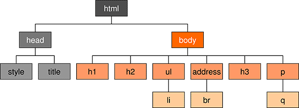

# [STS-10] 웹프로그래밍 :: 짧고 굵게 배우기

[![Dinfree][din-badge]][din-url]
[![Subject][basic-badge]][din-url]

[STS-10]은 웹프로그래밍의 핵심 개념에서 부터 주요 기술인 html, css, javascript를 비롯해 필수 응용 라이브러리인 bootstrap, jquery까지를 다루는 과정 입니다.

## CSS - 복합 선택자
이부분은 해당 챕터에 대한 설명과 안내가 나와야 하는데 우선 이부분은 비워 두도록 한다. 이부분은 해당 챕터에 대한 설명과 안내가 나와야 하는데 우선 이부분은 비워 두도록 한다.이부분은 해당 챕터에 대한 설명과 안내가 나와야 하는데 우선 이부분은 비워 두도록 한다.이부분은 해당 챕터에 대한 설명과 안내가 나와야 하는데 우선 이부분은 비워 두도록 한다.이부분은 해당 챕터에 대한 설명과 안내가 나와야 하는데 우선 이부분은 비워 두도록 한다.

### 목차
1. [상속](#m1)
2. [부모 자식 선택자](#m2)  
3. [가상클래스 선택자](#m3)

---
<a id="m1"></a>
## 1. 상속
`CSS에서 상속이란 계층구조에서 특정 속성들이 부모요소로부터 자식요소로 전달되는 개념입니다.` 부모의 색상이 빨강색이라면, 자식도 빨강색이라는 속성을 물려받는 것입니다. 하지만, 모든 CSS 속성들이 상속되는 것은 아닙니다. 예를 들어, 마진은 상속되지 않습니다. 자식요소가 부모와 동일한 마진을 가지는 경우는 거의 없기 때문입니다. 


<p></p>

- 프로그래밍에서의 상속은 상위 객체와 하위 객체의 `관계형 구조`를 의미합니다.
- 상속은 `부모 요소의 속성을 자식 요소가 물려받는 것`을 의미합니다. 
- 상속을 이용하면 코드의 중복성을 줄여주기 때문에 생산성을 높일 수 있습니다. 
- 유지 보수의 시간을 최소화시켜줍니다.


### 동영상 강좌
- 상속의 개념
  > https://bit.ly/2O4dQ1N <!-- 09:23 -->
- 코드를 이용한 상속의 개념
  > https://bit.ly/2AEEPPK <!-- 01:21 -->
- 상속과 오버라이딩
  > https://bit.ly/2vwNbTO <!-- 04:27 -->


 <!-- 15:11 -->

### 참고 자료
- MDN Web Docs - Inheritance
  > https://mzl.la/2vxI8m2
- Dorward's Ramblings - CSS Inheritance
  > https://bit.ly/2n78jMs

### 퀴즈
#### 1) 상속의 개념에 대해 서술하시오.
<details>
<summary>해답보기</summary>
<p></p>
<div markdown="1">

> 부모 요소의 속성을 자식 요소가 물려받는 것.
</div>
</details>

---
<a id="m2"></a>
## 2. 부모 자식 선택자
부모 자식 선택자란 부모 요소 하위에 있는 태그에 스타일을 적용시킬 때 사용 하는 선택자입니다.


<p></p>

#### 1) 선택자A 선택자 B (공백) 
- 선택자A의 `후손`인 선택자B 선택.
- 지정된 요소의 하위 항목인 모든 요소를 찾습니다.
- \<body>태그의 모든 하위 항목 - \<h1>,\<h2>,\<ul>,\<address>,\<h3>,\<p>,\<li>,\<br>,\<q>

#### 2) 선택자A > 선택자B 
- 선택자A의 `자손`인 선택자B 선택.
- 지정된 요소의 `직접 하위 요소`인 모든 요소를 선택합니다.
- \<body>태그의 직접 하위 항목 - \<h1>,\<h2>,\<ul>,\<address>,\<h3>,\<p>

#### 3) 선택자A + 선택자B
- 가장 가까운 형제 요소에 속성 적용.
- 형제 요소는 같은 부모를 가져야합니다.
- \<h1>태그의 인접 형제 요소 - \<h2>

#### 4) 선택자A ~ 선택자B
- 지정된 요소의 형제인 모든 요소를 선택합니다.
- \<h1>태그의 모든 형제 요소 - \<h2>,\<ul>,\<address>,\<h3>,\<p>

#### 5) 지정선택자와 하위 선택자 비교.
- 지정선택자: `p.box {...}`
```css
<p class="box"> ... </p>
```
- 하위선택자: `p .box {...}`(공백)
```css
<p>
  <div class="box">
  ...
  </div>
</p>
```

### 동영상 강좌
- 부모 자식 선택자
  > https://bit.ly/2Lf7Ia8 <!-- 08:21 -->
- 후손 자손 선택자
  > https://bit.ly/2uD1eXY (31:50 ~ 39:20) <!-- 07:30 -->
- 연결 선택자 - 하위선택자, 자식선택자, 형제선택자
  > https://bit.ly/2uFjz6L (00:00 ~ 07:40) <!-- 07:40 -->
- 후손 선택자
  > https://bit.ly/2O4jXmG <!-- 04:22 -->
- 자손 선택자
  > https://bit.ly/2LPKzvc <!-- 03:42 -->
- nth 자손 선택자
  > https://bit.ly/2vwOdza <!-- 03:15 -->


 <!-- 34:50 -->

### 참고 자료
- ofcourse - 부모 자식 선택자
  > https://bit.ly/2LBeRxj 
- MDN Web Docs - 자식 선택자
  > https://mzl.la/2LOBW46
- MDN Web Docs - 후손 선택자
  > https://mzl.la/2vzaOej

### 퀴즈
#### 1) CSS에서 부모 자식간의 관계에 대해 서술하시오.
<details>
<summary>해답보기</summary>
<p></p>
<div markdown="1">

> 부모 요소의 하위에 있는 요소들이 자식이 된다.
</div>
</details>

<br />

---
<a id="m3"></a>
## 3. 가상클래스 선택자
CSS 가상 요소는 지정된 요소에 스타일을 적용하는 데 사용됩니다. 예를 들어, 요소의 두 번째 문자나 선에 스타일을 지정할 수 있고, 요소의 내용 앞이나 뒤에 내용을 삽입할 수도 있습니다. 또한, 가상클래스는 어떤 요소의 특정 상태를 지정해줄 때 사용합니다. 


- `가상 클래스`는 이름 앞에 `콜론(:)`을 붙여 표시합니다.
- `가상 요소`는 클래스 이름 앞에 `콜론 두개(::)`를 붙여 표시합니다.
- `사용자 동작에 반응`하는 가상클래스 (link, visited, hover, active, focus)
- `UI 요소 상태`에 따른 가상클래스 (enable, disabled, checked)
- `구조 가상 클래스` (root, nth-child(n), nth-last-child(n), first-child, last-child)


### 동영상 강좌
- 가상클래스 선택자
  > https://bit.ly/2Nwxa7w <!-- 07:37 -->
- 가상클래스와 가상요소
  > https://bit.ly/2myAT9l <!-- 23:09 -->
- 실시간 코딩을 통한 가상클래스
  > https://bit.ly/2n9q0eu <!-- 03:48 -->

 <!-- 34:34 -->

### 참고 자료
- w3school - 가상 클래스
  > https://bit.ly/2IsWSXL
- w3school - 가상 요소
  > https://bit.ly/2pz6uI0
- ofcourse - 가상 선택자
  > https://bit.ly/2Lctj2S 
- MDN Web Docs - Pseudo classes and elements
  > https://mzl.la/2KneEg3
- Tech Altum Tutorial - 가상 선택자
  > https://bit.ly/2Kt4nie


### 퀴즈
#### 1) CSS에서 가상선택자의 역할이 무엇입니까?
<details>
<summary>해답보기</summary>
<p></p>
<div markdown="1">

> 사용자의 반응으로 생성되는 특정 상태를 지정할 때 그 타겟이 어떤 것인지 알려주는 역할을 한다.
</div>
</details>

#### 2) 가상선택자에서 :active 는 어떤 역할을 합니까?
<details>
<summary>해답보기</summary>
<p></p>
<div markdown="1">

> :active는 사용자가 마우스로 클릭한 태그를 선택했을 때의 상태를 지정해준다.
</div>
</details>

<!-- 1:24:35 -->

[din-badge]:https://img.shields.io/badge/dinfree-edu-orange.svg
[din-url]:https://github.com/dinfree
[basic-badge]:https://img.shields.io/badge/core-basic-green.svg
