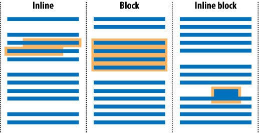
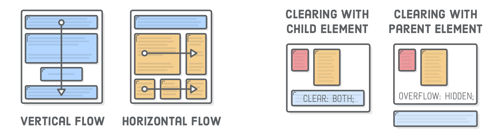

# [STS-10] 웹프로그래밍 :: 짧고 굵게 배우기

[![Dinfree][din-badge]][din-url]
[![Subject][basic-badge]][din-url]

[STS-10]은 웹프로그래밍의 핵심 개념에서 부터 주요 기술인 html, css, javascript를 비롯해 필수 응용 라이브러리인 bootstrap, jquery까지를 다루는 과정 입니다.

## CSS - 레이아웃
이부분은 해당 챕터에 대한 설명과 안내가 나와야 하는데 우선 이부분은 비워 두도록 한다. 이부분은 해당 챕터에 대한 설명과 안내가 나와야 하는데 우선 이부분은 비워 두도록 한다.이부분은 해당 챕터에 대한 설명과 안내가 나와야 하는데 우선 이부분은 비워 두도록 한다.이부분은 해당 챕터에 대한 설명과 안내가 나와야 하는데 우선 이부분은 비워 두도록 한다.이부분은 해당 챕터에 대한 설명과 안내가 나와야 하는데 우선 이부분은 비워 두도록 한다.

### 목차
1. [Inline-block](#m1)
2. [Align](#m2)
3. [포지셔닝](#m3)

---
<a id="m1"></a>
## 1. Inline-block
HTML 요소는 블록 레벨인지 인라인 레벨인지에 따라 나열 방법이 달라집니다. 블록 레벨요소는 태그를 사용해 요소를 삽입했을 때 혼자 한 줄을 차지하는 요소입니다. 이것은 해당 요소의 너비가 100% 라는 의미이기도 합니다. 반면, 인라인 레벨요소는 줄을 차지하지 않는 요소입니다. 화면에 표시되는 콘텐츠만큼만 영역을 차지하고 나머지 공간에는 다른 요소가 올 수 있습니다.


<p></p>

#### 1) block
- 가로 길이가 기본적으로 `100%`이며, 줄바꿈이 일어나는 태그입니다.
- width, height 속성을 지정할 수 있으며, 레이아웃 배치시 주로 쓰입니다.
- \<div>, \<p>, \<h1>~\<h6>, \<form>

#### 2) inline
- block과 달리 줄바꿈이 되지 않고, width, height를 지정할 수 없습니다.
- \<span>, \<a>, \

#### 3) inline-block
- block과 inline의 중간형태.
- 줄바꿈이 되지 않지만 크기를 지정할 수 있습니다.


### 동영상 강좌
- Inline-Block의 개념
  > https://bit.ly/2uHTHXY <!-- 05:39 -->
- Inline과 Block 요소
  > https://bit.ly/2O5e34Y <!-- 09:17 -->
- 속성에 따른 inline-block 요소의 변화 1
  > https://bit.ly/2n9qEZu <!-- 04:08 -->
- 속성에 따른 inline-block 요소의 변화 2
  > https://bit.ly/2Kq9sbb <!-- 02:28 -->
- Inline, block 그리고 inline-block
  > https://bit.ly/2vzozcX <!-- 03:15 -->

 <!-- 24:47 -->

### 참고 자료
- w3school - inline-block
  > https://bit.ly/2vmKOFT
- MDN web docs - Inline 요소
  > https://mzl.la/2Md8PDz
- 4PSA - inline, block
  > https://bit.ly/2Kojgm3

### 퀴즈
#### 1) Inline과 Block의 차이점은 무엇입니까?
<details>
<summary>해답보기</summary>
<p></p>
<div markdown="1">

> 인라인은 특정영역만 차지하지만, 블록은 가로영역전체를 차지합니다.
</div>
</details>

#### 2) 태그 중 Inline에 해당하는 요소는 어떤 것이 있나요?
<details>
<summary>해답보기</summary>
<p></p>
<div markdown="1">

- \<b>
- \
- \<input>
</div>
</details>

<br />

---
<a id="m2"></a>
## 2. Align
Align은 요소들을 정렬하는 속성입니다. 블록 안에 있는 텍스트는 text-align 속성을 이용하여 글자를 정렬합니다. 요소 배치에는 Float, clear, overflow 속성을 이용합니다. 이 속성들을 이용하여 요소들을 배치하며 레이아웃을 구성합니다.

<p></p>


#### 1) text-align
|value|description|
|---|---|
|left|왼쪽 정렬|
|right|오른쪽 정렬|
|center|중앙 정렬|
|justify|양쪽 정렬|

#### 2) float
- float 속성은 웹 요소를 문서 위에 떠 있게 만듭니다. 즉, 특정 요소가 다른 요소의 좌/우에 배치되도록 지정할 수 있습니다.
- `float: left;`나 `float: right;`를 지정하면 너비 값은 콘텐츠를 표시할 때 필요한 만큼만 차지하고 다른 요소가 들어올 만큼의 공간을 비워 둡니다.
 
#### 3) clear
- clear 속성은 float 속성이 더 이상 유용하지 않다고 알려 주는 속성입니다.
- 만약 `float: left;`로 왼쪽으로 배치했다면 `clear: left;`로 무효화시킬 수 있습니다.
- 무조건 기본 상태로 되돌리고 싶다면 `clear: both;`라고 하면 됩니다.

#### 4) overflow
- overflow 속성은 큰 단락이 포함될 경우 영역에 넘치는 텍스트를 잘라내거나 스크롤로 보이는 등의 설정을 해주는 속성입니다.
- 속성 값으로는 visible, hidden, scroll, auto, inherit 가 있습니다.

### 동영상 강좌
- Text Align
  > https://bit.ly/2NBxFNA <!-- 04:03 -->
- Text Align 속성
  > https://bit.ly/2AyOmaS <!-- 01:10 -->
- Float 개념
  > https://bit.ly/2O8gR1L <!-- 07:56 -->
- Float 응용
  > https://bit.ly/2LyN7g2 <!-- 21:52 -->
- 코딩을 통한 Floating
  > https://bit.ly/2MeKE7G <!-- 04:45 -->
- Overflow 속성
  > https://bit.ly/2AF9HQ8 <!-- 02:08 -->

 <!-- 36:41 -->
 <!-- 05:13 -->

### 참고 자료
- w3school - Align
  > https://bit.ly/2j6sbk4
- ofcourse - text align
  > https://bit.ly/2JOQRp6 
- w3school - Float and Clear
  > https://bit.ly/2xrXzPK
- w3school - overflow
  > https://bit.ly/2vvaq0o
- ofcourse - Float, Clear
  > https://bit.ly/2vxikq1
- Tech Altum Tutorial - CSS Float and Clear 
  > https://bit.ly/2v9NXGT
- MDN web docs - Float examples
  > https://mzl.la/2AzgtXz

### 퀴즈
#### 1) Text를 오른쪽 정렬하는 코드를 작성하시오.
<details>
<summary>해답보기</summary>
<p></p>
<div markdown="1">

```css
#id_name { text-align: right; }
```
</div>
</details>

#### 2) Float는 텍스트와 이미지를 __ __할때 사용합니다.
<details>
<summary>해답보기</summary>
<p></p>
<div markdown="1">

- 배치
</div>
</details>

<br />

---
<a id="m3"></a>
## 3. 포지셔닝
문서 내에 삽입된 여러 가지 요소들은 별도의 위치 지정이 되지 않은 경우 기본적으로 상/하로 나열됩니다. CSS에서는 position과 float 속성을 통해 HTML 여러 요소들에 대해 위치를 직접 적용하고 레이아웃을 구성할 수 있습니다. position 속성은 문서 내 위치를 직접 지정할 수 있다는 것이 float속성과의 차이점입니다.


> Position 속성은 요소에 사용되는 위치 지정 방법의 유형을 지정합니다.

#### 1) Static
- position 속성의 `기본값`으로, 요소를 나열한 `순서대로 배치`하며 top, right, bottom, left와 같은 속성을 사용할 수 없습니다.
- float 속성을 이용해 `좌우로 배치`할 수 있습니다.

#### 2) Relative
- static과 같이 나열한 `순서대로 배치`되지만 top, right, bottom, left 속성을 사용할 수 있습니다.
- `원래 있던 위치를 기준`으로 좌표값을 지정하여 `상/하/좌/우`로 배치할 수 있습니다.

#### 3) Absolute
- top, right, bottom, left 속성값을 이용해 요소를 `원하는 위치에 배치`할 수 있습니다.
- 이때 기준 위치는 `가장 가까운 상위 요소 중 position 속성이 relative인 요소`입니다. 그래서 absolute를 사용할 땐, 그 `요소를 감싸는 상자`를 만들고 `position을 relative`로 지정해놓고 사용해야 합니다.
- 상위 요소가 없다면 화면 좌측상단을 기준으로 요소가 지정됩니다.

#### 4) Fixed
- absolute 속성 값처럼 위치를 좌표로 결정하지만 기준이 부모요소가 아닌 `브라우저 창`이 됩니다.
- `브라우저 창의 왼쪽 위 꼭지점을 원점`으로 좌표가 계산되며 창을 스크롤하더라도 계속 `고정되어 표시`됩니다. 즉, 페이지가 스크롤 되어도 항상 같은 위치에 유지됩니다. 


### 동영상 강좌
- CSS 그리드
  > https://bit.ly/2v27Vmb <!-- 09:53 -->
- 포지셔닝과 주요 속성들
  > https://bit.ly/2O5FkEc <!-- 14:37 -->
- 박스 레이아웃
  > https://bit.ly/2O9efQG <!-- 20:26 -->
- Absolute Position 
  > https://bit.ly/2LRhjUP <!-- 02:54 -->
- Fixed Position
  > https://bit.ly/2Kk8PQt <!-- 02:24 -->
- Relative Position
  > https://bit.ly/2O8Zk8P <!-- 09:59 -->
- CSS 레이아웃 포지셔닝
  > https://bit.ly/2OI0LfU <!-- 18:48 -->

 <!-- 1:19:01 -->

### 참고 자료
- w3school - Position
  > https://bit.ly/2qs4kK3
- ofcourse - Position 속성
  > https://bit.ly/2JJw3Pu
- MDN web docs - Positioning
  > https://mzl.la/2O4DO5c
- Tech Altum Tutorial - CSS Positions
  > https://bit.ly/2OEz5bF

### 퀴즈
#### 1) Relative와 Absolute 포지셔닝의 차이점은 무엇입니까?
<details>
<summary>해답보기</summary>
<p></p>
<div markdown="1">

> relative는 원래 있던 위치가 기준 좌표값이 되지만, Absolute는 가장 가까운 상위 요소가 기준 좌표값이 되어 배치됩니다. 
</div>
</details>

<!-- 2:25:42 -->

[din-badge]:https://img.shields.io/badge/dinfree-edu-orange.svg
[din-url]:https://github.com/dinfree
[basic-badge]:https://img.shields.io/badge/core-basic-green.svg
