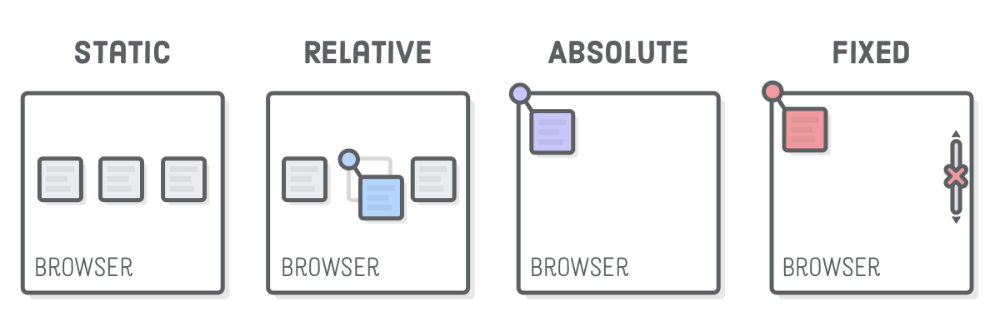

# [STS-10] 웹프로그래밍 :: 짧고 굵게 배우기

[![Dinfree][din-badge]][din-url]
[![Subject][basic-badge]][din-url]

[STS-10]은 웹프로그래밍의 핵심 개념에서 부터 주요 기술인 html, css, javascript를 비롯해 필수 응용 라이브러리인 bootstrap, jquery까지를 다루는 과정 입니다.

## CSS - 레이아웃
이부분은 해당 챕터에 대한 설명과 안내가 나와야 하는데 우선 이부분은 비워 두도록 한다. 이부분은 해당 챕터에 대한 설명과 안내가 나와야 하는데 우선 이부분은 비워 두도록 한다.이부분은 해당 챕터에 대한 설명과 안내가 나와야 하는데 우선 이부분은 비워 두도록 한다.이부분은 해당 챕터에 대한 설명과 안내가 나와야 하는데 우선 이부분은 비워 두도록 한다.이부분은 해당 챕터에 대한 설명과 안내가 나와야 하는데 우선 이부분은 비워 두도록 한다.

### 목차
1. Inline-Block
2. Align
3. 포지셔닝
4. Float

---
## 1. Inline-Block

HTML 태그는 인라인과 블록, 인라인-블록 요소 3가지로 구분할 수 있습니다.


<p></p>

- 인라인 요소는 특정부분만 영역을 차지합니다. 
- 블록 요소는 가로영역 전체를 차지하며, 하나의 블록 형태를 띕니다. 따라서 자동 줄바꿈이 일어납니다.


### 동영상 강좌
- Inline-Block의 개념
  > https://bit.ly/2uHTHXY <!-- 05:39 -->
- Inline과 Block 요소
  > https://bit.ly/2O5e34Y <!-- 09:17 -->
- 속성에 따른 inline-block 요소의 변화 1
  > https://bit.ly/2n9qEZu <!-- 04:08 -->
- 속성에 따른 inline-block 요소의 변화 2
  > https://bit.ly/2Kq9sbb <!-- 02:28 -->
- Inline, block 그리고 inline-block
  > https://bit.ly/2vzozcX <!-- 03:15 -->

 <!-- 24:47 -->

### 참고 자료
- w3school - inline-block
  > https://bit.ly/2vmKOFT
- MDN web docs - Inline 요소
  > https://mzl.la/2Md8PDz
- 4PSA - inline, block
  > https://bit.ly/2Kojgm3

### 퀴즈
#### 1) Inline과 Block의 차이점은 무엇입니까?
<details>
<summary>해답보기</summary>
<p></p>
<div markdown="1">

```
인라인은 특정영역만 차지하지만, 블록은 가로영역전체를 차지합니다.
```
</div>
</details>

#### 2) 태그 중 Inline에 해당하는 요소는 어떤 것이 있나요?
<details>
<summary>해답보기</summary>
<p></p>
<div markdown="1">

- \<b>
- \
- \<input>
</div>
</details>

<br />

---
## 2. Align

Align은 요소들을 정렬하는 속성입니다. text-align은 글자를 정렬합니다. 


- Left는 왼쪽 정렬, Right는 오른쪽 정렬하는 속성값입니다.
- Center는 중앙 정렬, Justify는 양쪽 정렬하는 속성값입니다.

### 동영상 강좌
- Text Align
  > https://bit.ly/2NBxFNA <!-- 04:03 -->
- Text Align 속성
  > https://bit.ly/2AyOmaS <!-- 01:10 -->


 <!-- 05:13 -->

### 참고 자료
- w3school - Align
  > https://bit.ly/2j6sbk4
- ofcourse - text align
  > https://bit.ly/2JOQRp6 

### 퀴즈
#### 1) Text를 오른쪽 정렬하는 코드를 작성하시오.
<details>
<summary>해답보기</summary>
<p></p>
<div markdown="1">

```css
#id_name { text-align: right; }
```
</div>
</details>

<br />

---
## 3. 포지셔닝

position속성은 요소에 사용되는 위치 지정 방법의 유형 (Static, Relative, Absolute, Fixed)을 지정합니다.



##### 1) STATIC (정적)
```css
HTML 요소는 기본적으로 정적으로 배치됩니다.
정적으로 배치 된 요소는 위쪽, 아래쪽, 왼쪽 및 오른쪽 속성의 영향을받지 않습니다.
```

##### 2) Relative(상대적)
```css
이 포지셔닝은 초기 위치에 영향을 받습니다.
해당 요소가 정상 위치에서 벗어나 있다면, 다른 요소는 그 요소가 남긴 틈에 영향을 받지 않습니다.
```

##### 3) Absolute(절대적)
```css
이 포지셔닝은 가장 가까운 위치에 있는 조상과 관련하여 배치됩니다.
```

##### 4) Fixed(고정적)
```css
이 포지셔닝은 뷰포트를 기준으로 배치됩니다. 
즉, 페이지가 스크롤 되어도 항상 같은 위치에 유지됩니다. 
위쪽, 오른쪽, 아래쪽 및 왼쪽 속성은 요소의 위치를 ​​지정할 때 사용됩니다.
```

### 동영상 강좌
- CSS 그리드
  > https://bit.ly/2v27Vmb <!-- 09:53 -->
- 포지셔닝과 주요 속성들
  > https://bit.ly/2O5FkEc <!-- 14:37 -->
- 박스 레이아웃
  > https://bit.ly/2O9efQG <!-- 20:26 -->
- Absolute Position 
  > https://bit.ly/2LRhjUP <!-- 02:54 -->
- Fixed Position
  > https://bit.ly/2Kk8PQt <!-- 02:24 -->
- Relative Position
  > https://bit.ly/2O8Zk8P <!-- 09:59 -->
- CSS 레이아웃 포지셔닝
  > https://bit.ly/2OI0LfU <!-- 18:48 -->

 <!-- 1:19:01 -->

### 참고 자료
- w3school - Position
  > https://bit.ly/2qs4kK3
- ofcourse - Position 속성
  > https://bit.ly/2JJw3Pu
- MDN web docs - Positioning
  > https://mzl.la/2O4DO5c
- Tech Altum Tutorial - CSS Positions
  > https://bit.ly/2OEz5bF

### 퀴즈
#### 1) Relative와 Absolute 포지셔닝의 차이점은 무엇입니까?
<details>
<summary>해답보기</summary>
<p></p>
<div markdown="1">

```
relative는 상대 위치이며, 초기 위치를 기준으로 좌표 속성을 통해 이동할 수 있고, 다른 객체에 영향을 주지 않습니다. 
Absolute는 절대 위치이며, 조상객체의 위치를 좌표의 기준으로 삼습니다. 
```
</div>
</details>

<br />

---
## 4. Float

float 라는 단어는 원래 ‘뜨다’ 라는 의미이며, 웹페이지에서 이미지를 어떻게 띄워서 텍스트와 함께 배치할 것인가에 대한 속성입니다.


- Float 속성은 이미지와 텍스트를 배치해주는 역할입니다.
- 현재는 웹페이지의 배치 및 레이아웃용으로 사용되고 있습니다.

### 동영상 강좌
- Float 개념
  > https://bit.ly/2O8gR1L <!-- 07:56 -->
- Float 응용
  > https://bit.ly/2LyN7g2 <!-- 21:52 -->
- 코딩을 통한 Floating
  > https://bit.ly/2MeKE7G <!-- 04:45 -->
- Overflow 속성
  > https://bit.ly/2AF9HQ8 <!-- 02:08 -->


 <!-- 36:41 -->

### 참고 자료
- w3school - Float and Clear
  > https://bit.ly/2xrXzPK
- w3school - overflow
  > https://bit.ly/2vvaq0o
- ofcourse - Float, Clear
  > https://bit.ly/2vxikq1
- Tech Altum Tutorial - CSS Float and Clear 
  > https://bit.ly/2v9NXGT
- MDN web docs - Float examples
  > https://mzl.la/2AzgtXz


### 퀴즈
#### 1) Float는 텍스트와 이미지를 __ __할때 사용합니다.
<details>
<summary>해답보기</summary>
<p></p>
<div markdown="1">

- 배치
</div>
</details>

<!-- 2:25:42 -->


[din-badge]:https://img.shields.io/badge/dinfree-edu-orange.svg
[din-url]:https://github.com/dinfree
[basic-badge]:https://img.shields.io/badge/core-basic-green.svg
