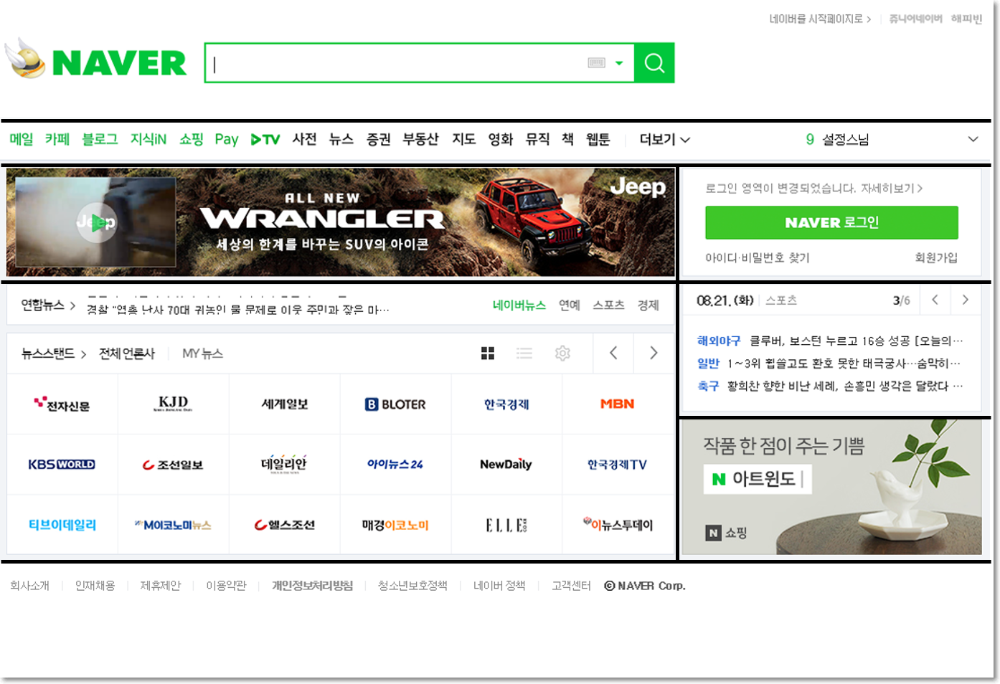

# [STS-121 종합실습] 웹 프론트엔드 개발 기초::HTML

[![Dinfree][din-badge]][din-url]
[![Subject][html-badge]][din-url]
[![Subject][css-badge]][din-url]
[![Subject][js-badge]][din-url]

## 시작하기 전에
이 페이지는 프론트엔드 웹 프로그래밍의 기본이 되는 [STS-121] HTML 기초 강좌의 종합실습 페이지 입니다. 기본실습 예제와 달리 종합실습에서는 HTML 구성요소들을 종합적으로 이해하고 응용 할 수 있는 예제로 구성 되어 있습니다.

### 목차
1. [포탈 메인 화면 만들기](#m1)
2. [게시판 만들기](#m2)

---
<a id="m1"></a>
## 1. 포탈 메인 화면 만들기
### 개요
본 예제에서는 네이버, 다음과 같은 포탈의 메인화면을 만들어 봅니다. 물론 css를 아직 배우지 않았기 때문에 제대로 된 화면을 제작하기는 매우 어렵지만 지금까지 배운 html 태그들을 모두 활용해 최대한 비슷하게 구성해 봅니다.

### step-1> 대상 선정하기
```
크롬 웹브라우저를 실행 합니다. 인터넷 익스플로러/엣지 브라우저도 상관없으나 모든 설명은 크롬을 기준으로 합니다.
```
- 크롬 웹브라우저에서 '네이버'를 들어갑니다.
- 네이버 메인 화면을 기준으로 합니다.
- 메인 화면 전체가 아닌 부분만 구성합니다.


### step-2> 레이아웃 분석하기
```
- 웹프라우저 상단의 URL 창에 다음의 주소중 하나를 입력하고 엔터를 칩니다.
- http://www.naver.com
- http://www.apple.com
```
- HTML 테이블태그를 이용합니다.
- 먼저 헤드, 바디, 푸터 3부분으로 레이아웃을 나눕니다.
- 병합이 이루어진 셀은 colspan과 rowspan을 이용하여 구성합니다.


### step-3> 리소스 준비하기
```
- 웹브라우저 화면에서 오른쪽 마우스를 눌러 페이지 소스보기를 선택합니다.
- 보이는 텍스트들이 현재 화면을 구성하고 있는 html 소소 입니다.
```
- 우클릭하여 이미지 저장이 안되는 컨텐츠는 캡처를 합니다.
- 아이콘은 [iconfinder](https://www.iconfinder.com/)라는 사이트를 이용합니다.
- 리소스는 해당 소스파일이 있는 폴더 안에 res폴더를 만들어 저장합니다.

### step-4> 소스 코딩
```
- 웹브라우저 화면에서 오른쪽 마우스를 눌러 페이지 소스보기를 선택합니다.
- 보이는 텍스트들이 현재 화면을 구성하고 있는 html 소소 입니다.
```

### step-5> 결과 확인
```
- 웹브라우저 화면에서 오른쪽 마우스를 눌러 페이지 소스보기를 선택합니다.
- 보이는 텍스트들이 현재 화면을 구성하고 있는 html 소소 입니다.
```


---
<a id="m2"></a>
## 2. 게시판 만들기
### 개요
본 예제에서는 네이버, 다음과 같은 포탈의 메인화면을 만들어 봅니다. 물론 css를 아직 배우지 않았기 때문에 제대로 된 화면을 제작하기는 매우 어렵지만 지금까지 배운 html 태그들을 모두 활용해 최대한 비슷하게 구성해 봅니다.

### step-1> 대상 선정하기
```
크롬 웹브라우저를 실행 합니다. 인터넷 익스플로러/엣지 브라우저도 상관없으나 모든 설명은 크롬을 기준으로 합니다.
```
### step-2> 레이아웃 분석하기
```
- 웹프라우저 상단의 URL 창에 다음의 주소중 하나를 입력하고 엔터를 칩니다.
- http://www.naver.com
- http://www.apple.com
```

### step-3> 소스 코딩
```
- 웹브라우저 화면에서 오른쪽 마우스를 눌러 페이지 소스보기를 선택합니다.
- 보이는 텍스트들이 현재 화면을 구성하고 있는 html 소소 입니다.
```

### step-4> 결과 확인
```
- 웹브라우저 화면에서 오른쪽 마우스를 눌러 페이지 소스보기를 선택합니다.
- 보이는 텍스트들이 현재 화면을 구성하고 있는 html 소소 입니다.
```


[din-badge]:https://img.shields.io/badge/dinfree-edu-orange.svg
[din-url]:https://github.com/dinfree
[css-badge]:https://img.shields.io/badge/frontend-css-ff69b4.svg
[html-badge]:https://img.shields.io/badge/frontend-html-brightgreen.svg
[js-badge]:https://img.shields.io/badge/frontend-javascript-red.svg
