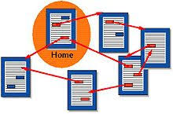
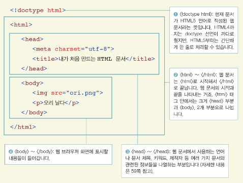

# [STS-10] 웹프로그래밍 :: 짧고 굵게 배우기

[![Dinfree][din-badge]][din-url]
[![Subject][basic-badge]][din-url]

[STS-10]은 웹프로그래밍의 핵심 개념에서 부터 주요 기술인 html, css, javascript를 비롯해 필수 응용 라이브러리인 bootstrap, jquery까지를 다루는 과정 입니다.

## HTML: 월드와이드웹과 HTML
이부분은 해당 챕터에 대한 설명과 안내가 나와야 하는데 우선 이부분은 비워 두도록 한다. 이부분은 해당 챕터에 대한 설명과 안내가 나와야 하는데 우선 이부분은 비워 두도록 한다.이부분은 해당 챕터에 대한 설명과 안내가 나와야 하는데 우선 이부분은 비워 두도록 한다.이부분은 해당 챕터에 대한 설명과 안내가 나와야 하는데 우선 이부분은 비워 두도록 한다.이부분은 해당 챕터에 대한 설명과 안내가 나와야 하는데 우선 이부분은 비워 두도록 한다.

### 목차
1. 월드와이드웹이란?
2. HTML 소개
3. HTML 기본 작성법
4. HTML 기본 구조

---
## 1. 월드와이드웹이란?
웹이라고도 불리며, 다양한 형태의 데이터와 정보에 접근할 수 있도록 해주는 `인터넷 서비스`이다. 팀 버너스-리에 의해 개발되어 보편적인 인터넷 서비스로 확대되었다.


<!-- 이미지 주소 : http://techlearninghub.com/difference-bw-internet-web/ -->

- 웹은 인터넷 상의 정보를 `하이퍼텍스트` 방식과 멀티미디어 환경에서 검색 할 수 있게 해주는 정보 검색 시스템이다.
- 웹 서비스는 많은 사람이 정보를 쉽게 공유하고 접근할 수 있도록 하는 것이 목적이다.
- 웹은 전 세계 컴퓨터를 연결하며 HTTP 프로토콜을 사용하고 HTML로 작성된 문서를 연결해 멀티미디어 서비스를 제공한다.
- 인터넷은 `컴퓨터 네트워크 망`을 의미하고, 웹은 `인터넷 서비스`이다.

### 동영상 강좌
- What is the world wide web? (3:54)
  > http://bit.ly/2zXoOnv
- 웹 서비스? (2:39)
  > http://bit.ly/2mBncGF
- 웹의 개요(4:46)
  > http://bit.ly/2NAmS6t (~4:46)
- 인터넷과 웹의 역사 (8:07)
  > http://bit.ly/2Lg2CKH
- 웹의 의미와 역사 (10:37)
  > http://bit.ly/2NCDvP5

### 참고 자료
> pdf, ppt, slideshare, 관련정보사이트 등 충분하게. 영상과 마찬가지로 추후 설명이 추가 되어야 함.
- 웹이란 무엇인가: http://bit.ly/2zWAYgD
- 웹의 역사: http://bit.ly/2uTkcZS
- 인터넷과 웹의 역사: http://bit.ly/2mz5fIE

### 퀴즈
#### 1) 월드 와이드 웹이란 무엇인가
<details>
<summary>해답보기</summary>
<p></p>
<div markdown="1">

```
다양한 형태의 데이터와 정보에 접근할 수 있도록 해주는 인터넷 서비스
```

</div>

</details>

#### 2) 웹과 인터넷에 대해 서술하시오
<details>
<summary>해답보기</summary>
<p></p>
<div markdown="1">

```
인터넷은 컴퓨터 네트워크 망을 의미하고, 웹은 인터넷 서비스 중 하나입니다.
```
</div>

</details>

## 2. HTML 소개
웹 문서를 만들기 위해 사용하는 프로그래밍 언어 중 하나이다. 하이퍼텍스트 작성을 위해 개발되었으며, 대부분의 웹 페이지들은 HTML로 작성된다.


<!-- 이미지 주소 : http://kyd5083.blogspot.com/2013/02/web-html.html -->

- HTML은 `HyperText Markup Language`의 약자로, 문서의 글자 크기나 색깔, 모양, 문서 이동 등에 관여한다.
- HyperText : 단순 텍스트 이상의, `링크` 등의 개념이 포함 된 텍스트
- Markup : 꺽쇠(<, >)로 이루어진 `태그`를 사용하는 규격
- HTML로 작성된 문서를 웹 브라우저가 해석하여 이용자에게 보여주게 된다.

### 동영상 강좌
- 웹 프로그래밍이란? (10:34)
  > http://bit.ly/2O5bpwC (5:06~15:40)
- HTML에서 hyperText Markup 의미
  > http://bit.ly/2NwOSYy (7:14)
- 언어로써의 HTML 의미 알아보기(3:36)
  > http://bit.ly/2JPbFwI (~3:36)
- HTML의 역사 (10:09)
  > http://bit.ly/2Nzjzwc


### 참고 자료
> pdf, ppt, slideshare, 관련정보사이트 등 충분하게. 영상과 마찬가지로 추후 설명이 추가 되어야 함.
- HTML 입문: http://bit.ly/2mBnMUR
- HTML5와 XHTML: http://bit.ly/2LDiX8t  
- HTML 기초: http://bit.ly/2JLN7V5

### 퀴즈
#### 1) HTML은 무엇의 약자인가
<details>
<summary>해답보기</summary>
<p></p>
<div markdown="1">

```
HyperText Markup Language
```

</div>

</details>


## 3. HTML 기본 작성법
HTML에서는 `태그(Tag)`를 사용하며, `<>`를 사용하여 나타낸다. 태그는 일반적으로 시작과 끝을 표시하는 `2개의 쌍`으로 이루어져 있으며, 종료태그는 `/`로 시작된다. 태그의 이름은 규칙으로 정해져 있고 태그마다 역할이 다르다.


<!--이미지 주소 : https://developer.mozilla.org/en-US/docs/Learn/Getting_started_with_the_web/HTML_basics-->

- `<strong> hello world </strong>`처럼 태그를 사용해 데이터를 표현한다.
- 태그 안에 다른 태그가 들어 갈 수 있으나, 연 순서대로 닫아야 한다.
- 일부 태그는 닫는 태그가 없는 경우도 있다. 이때 `<태그 />`처럼 사용하기도 한다.
- 주석은 `<!--내용-->`의 형식으로 사용한다.

### 동영상 강좌
- HTML 기본 문법 (12:07)
  > http://bit.ly/2uViKGB
- HTML 태그의 속성과 div태그 (4:53)
  > http://bit.ly/2JLPjvN
- 닫는 태그의 사용규칙 (2:49)
  > http://bit.ly/2O4LHbP
- HTML 주석 달기 (1:41)
  > http://bit.ly/2Led1GJ


### 참고 자료
> pdf, ppt, slideshare, 관련정보사이트 등 충분하게. 영상과 마찬가지로 추후 설명이 추가 되어야 함.
- 태그, 태그의 속성: http://bit.ly/2uWbcmU
- 주석: http://bit.ly/2NF5eyz
- 태그, 요소, 속성, 변수: http://bit.ly/2JOkQ07

### 퀴즈
#### 1) 옳게 태그를 사용한 것은 무엇인가
1. `<p>안녕하세요.`
2. `<strong><p>안녕하세요<strong><p>`
3. `<p>안녕하세요</p>`
4. `안녕하세요.</strong>`
<details>
<summary>해답보기</summary>
<p></p>
<div markdown="1">
정답 : 3번

> 1번 `<p>안녕하세요.` : 태그는 일반적으로 시작과 끝을 표시하는 `2개의 쌍`으로 이루어져야 된다.

> 2번 `<strong><p>안녕하세요<strong><p>` : 태그 안에 다른 태그가 들어 갈 수 있으나, 연 순서대로 닫아야 한다. 

> 4번 `안녕하세요.</strong>` : 태그는 일반적으로 시작과 끝을 표시하는 `2개의 쌍`으로 이루어져야 된다. 

</div>

</details>

#### 2) HTML에서 주석은 어떻게 사용 하는가
<details>
<summary>해답보기</summary>
<p></p>
<div markdown="1">

```
<!-- -->
```

</div>

</details>

## 4. HTML 기본 구조
HTML 문서는 `<!DOCTYPE html>`, `<html>`, `<head>`, `<title>`, `<body>`의 기본태그로 이루어져 있다. 


<!-- 사진 주소 : http://lux.cuenet.kr/93-->


- `<!DOCTYPE html>`: HTML5 문서를 선언하는 구문. 웹브라우저에게 문서가 HTML5로 작성됨을 알려준다.
- `<html> ~ </html>`: HTML 문서의 시작과 끝을 알린다. 
- `<head> ~ </head>`: 웹 페이지의 정보를 정의한다. 문서의 상단 제목을 표시하는 `<title>`태그, 문서 정보 설정하는 `<meta>`태그 등이 포함된다.
- `<body> ~ </body>`: 문서의 본문에 해당하는 부분으로, 실제 화면에 나타나는 내용을 작성한다.

### 동영상 강좌
- HTML 기본 구조 (13:24)
  > http://bit.ly/2LiK5xp
- HTML head (2:21)
  > http://bit.ly/2A2hozw
- Title 태그 (0:53)
  > http://bit.ly/2uWZicu
- meta 태그 (8:45)
  > http://bit.ly/2Lk5V3q
- 기본구조 및 시맨틱 태그 (12:51)
  > http://bit.ly/2LGlgYm
- 시맨틱 태그 (8:53)
  > http://bit.ly/2Ldy8Jj


### 참고 자료
> pdf, ppt, slideshare, 관련정보사이트 등 충분하게. 영상과 마찬가지로 추후 설명이 추가 되어야 함.
- 인코딩, Head태그, title 태그, meta 태그: http://bit.ly/2mA4Fu9
- HTML의 기본구성: http://bit.ly/2mDkIHy
- body, footer, header, head, html, meta, title 태그: http://bit.ly/2LuGaNa

### 퀴즈
#### 1) HTML의 기본 구조를 서술하시오.
<details>
<summary>해답보기</summary>
<p></p>
<div markdown="1">

```<!DOCTYPE html>
<html>
    <head>
    <title> </title>
    </head>
    
    <body>

    </body>
</html>
```

</div>

</details>

#### 2) Head에는 어떠한 것이 들어가는가
<details>
<summary>해답보기</summary>
<p></p>
<div markdown="1">

```
title 태그, meta 태그, 자바 스크립트 및 스타일시트 정의
```

</div>

</details>


[din-badge]:https://img.shields.io/badge/dinfree-edu-orange.svg
[din-url]:https://github.com/dinfree
[basic-badge]:https://img.shields.io/badge/core-basic-green.svg
