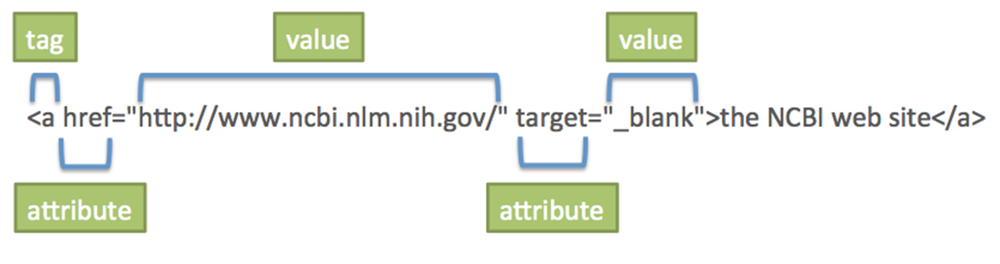

# [STS-10] 웹프로그래밍 :: 짧고 굵게 배우기

[![Dinfree][din-badge]][din-url]
[![Subject][basic-badge]][din-url]

[STS-10]은 웹프로그래밍의 핵심 개념에서 부터 주요 기술인 html, css, javascript를 비롯해 필수 응용 라이브러리인 bootstrap, jquery까지를 다루는 과정 입니다.

## HTML: 주요 태그
이부분은 해당 챕터에 대한 설명과 안내가 나와야 하는데 우선 이부분은 비워 두도록 한다. 이부분은 해당 챕터에 대한 설명과 안내가 나와야 하는데 우선 이부분은 비워 두도록 한다.이부분은 해당 챕터에 대한 설명과 안내가 나와야 하는데 우선 이부분은 비워 두도록 한다.이부분은 해당 챕터에 대한 설명과 안내가 나와야 하는데 우선 이부분은 비워 두도록 한다.이부분은 해당 챕터에 대한 설명과 안내가 나와야 하는데 우선 이부분은 비워 두도록 한다.

### 목차
1. 제목
2. 문단
3. 형식
4. 목록
5. 하이퍼링크

---
## 1. 제목
`<h>` 태그는 제목을 나타낸다. `<h1> ~ <h6>`까지 있는데, 숫자들은 제목의 등급을 나타낸다. `<h1>`이 가장 높은 등급이며 크기도 가장 크고, `<h6>`이 가장 낮은 등급이며 크기도 가장 작다. 


- 계층 구조에 맞게 순서대로 작성되어지는 것이 좋다.
- 컴퓨터 및 검색엔진이 문서를 파악하기 위해 쓰이므로, 상황에 맞게 `<h>`의 등급을 잘 써주는 것이 중요하다.


### 동영상 강좌
- h태그 (2:35)
  > http://bit.ly/2LG0qs9 (3:35~6:10)
- h1~h6 태그 (0:19)
  > http://bit.ly/2LH7xQY
- h태그 (2:10)
  > http://bit.ly/2LxKIT1 (7:50~10:00)


### 참고 자료
> pdf, ppt, slideshare, 관련정보사이트 등 충분하게. 영상과 마찬가지로 추후 설명이 추가 되어야 함.
- h# 태그: http://bit.ly/2uXwxfI
- h1 ~ h6: http://bit.ly/2Lh14Aa

### 퀴즈
#### 1) 크기가 가장 큰 h태그는 무엇인가
<details>
<summary>해답보기</summary>
<p></p>
<div markdown="1">

```
<h1>태그
```

</div>

</details>


## 2. 문단
`<p>`태그로 문단을 나타낸다. 본문 내에서 연속된 공백이나 줄 바꿈은 하나의 공백으로 처리하기 때문에, 문단 구분 시 `<p>`태그를, 줄 바꿈을 할 때는 `<br>`태그를 이용한다.


```html
<p>This is a paragraph.</p>
<p>This is a paragraph.</p>
<p>This is a paragraph.</p>
```
<details>
<summary>실행 결과 보기</summary>
<p></p>
<div markdown="1">
<p>This is a paragraph.</p>
<p>This is a paragraph.</p>
<p>This is a paragraph.</p>
</div>

</details>


```html
<p> To break lines <br> in a text, <br> use the br element.
```
<details>
<summary>실행 결과 보기</summary>
<p></p>
<div markdown="1">
<p> To break lines <br> in a text, <br> use the br element.
</div>

</details>


- `<br>`태그는 닫는 태그를 필요로 하지 않는다. `</br>`로 사용하기도 한다.
- 문단 구분을 위해 `<br/>` 태그를 연속으로 사용하는 것 보다는 `<p>`태그를 사용하는 것을 권장한다.


### 동영상 강좌
- p태그 (4:19)
  > http://bit.ly/2O9hng9
- 문단과 Line Break (7:52)
  > http://bit.ly/2Lejp0F


### 참고 자료
> pdf, ppt, slideshare, 관련정보사이트 등 충분하게. 영상과 마찬가지로 추후 설명이 추가 되어야 함.
- p 태그, br 태그: http://bit.ly/2O7hIzM
- 문단을 정의하는 태그, BR 강제 줄바꿈: http://bit.ly/2A32lWc 
- br, p 태그: http://bit.ly/2LEnwz7  

### 퀴즈
#### 1) p태그는 무엇을 나타내는 태그인가
<details>
<summary>해답보기</summary>
<p></p>
<div markdown="1">

```
문단을 나타내는 태그
```

</div>

</details>

#### 2) 개행을 원할 때 사용하는 태그는 무엇인가
<details>
<summary>해답보기</summary>
<p></p>
<div markdown="1">

```
<br> 또는 </br>
```

</div>

</details>


## 3. 형식
텍스트에 특별한 의미를 부여하는 특별한 요소들이 있다. 텍스트를 굵게 하는 `<b>`와 `<strong>`, 텍스트를 기울이는 `<i>`와 `<em>`, 하이라이트인 `<mark>`, 가운데를 선으로 표시하는 `<del>` 등이 있다. 

| element | meaning |
|:----:|:-----:|
|`<i>...</i>` | Italics |
|`<b>...</b>` | Bold |
|`<tt>...</tt>` | Teletype (monospaced) |
|`<u>...</u>` | Underline |
|`<s>...</s>` | Strikethrough |
|`<strike>...</strike>` | Strikethrough |
|`<sub>...</sub>` | Subscript |
|`<sup>...</sup>` | Superscript |
|`<big>...</big>` | Bigger font (one size bigger) |
|`<small>...</small>` | Smaller font (one size smaller) |


<!--이미지 주소 : http://96.0.245.61/mca_course/kurukshetra_university/semester4/webengineering/text_level_elements.php-->

- `<b>`는 텍스트가 중요하지 않지만 단순 진하게 표시할 때, `<strong>`은 중요한 텍스트를 표시할 때 사용한다.
- `<i>`는 이탤릭체로 표시할 때, `<em>`은 특정 텍스트를 이탤릭체로 강조하고자 할 때 사용한다.


### 동영상 강좌
- 텍스트 태그들 (1:56) 
  > http://bit.ly/2A2pA2v
- b태그, hr태그, i태그 (3:24)
  > http://bit.ly/2LuoOjz (29:46~33:10)
- Formatting Tags (6:05)
  > http://bit.ly/2Lwb2wD


### 참고 자료
> pdf, ppt, slideshare, 관련정보사이트 등 충분하게. 영상과 마찬가지로 추후 설명이 추가 되어야 함.
- b 요소와 strong 요소의 차이: http://bit.ly/2Lie6xh
- b 태그, i 태그: http://bit.ly/2JQUo62
- 텍스트 관련 태그: http://bit.ly/2NFyrtg
- b, em, i, mark, strong, u 태그: http://bit.ly/2O8YCcF

### 퀴즈
#### 1) b태그와 strong태그의 차이점을 서술하시오
<details>
<summary>해답보기</summary>
<p></p>
<div markdown="1">

```
b태그는 단순히 텍스트를 진하게, strong태그는 텍스트를 강조하는 의미를 담고 있다.
```
</div>

</details>


## 4. 목록
목록을 만들기 위해서 `<li>`태그를 사용한다. 이 태그는 단독으로 쓰이지 않으며, `<ul>`혹은 `<ol>`의 내부에 들어간다. 리스트 나열 뿐 아니라 메뉴 등을 만들 때에도 사용한다. 


```html
<ul>
  <li>Listenelement 1</li>
  <li>Listenelement 2</li>
  <li>Listenelement 3</li>
</ul>
```
<details>
<summary>실행 결과 보기</summary>
<p></p>
<div markdown="1">
<ul>
  <li>Listenelement 1</li>
  <li>Listenelement 2</li>
  <li>Listenelement 3</li>
</ul>
</div>

</details>

```html
<ol>
  <li>Listenelement 1</li>
  <li>Listenelement 2</li>
  <li>Listenelement 3</li>
</ol>
```
<details>
<summary>실행 결과 보기</summary>
<p></p>
<div markdown="1">
<ol>
  <li>Listenelement 1</li>
  <li>Listenelement 2</li>
  <li>Listenelement 3</li>
</ol>
</div>

</details>


<br>

- `<ol>` 태그는 번호를 메기는 순서가 있는 목록을 만든다.
- `<ul>` 태그는 순서없이 모양으로 목록을 만든다.


### 동영상 강좌
- 리스트와 리스트 타입 (3:10)
  > http://bit.ly/2LG6i4F
- 하위 항목이 있는 리스트 (2:42)
  > http://bit.ly/2JQWm6q (11:26~14:08)


### 참고 자료
> pdf, ppt, slideshare, 관련정보사이트 등 충분하게. 영상과 마찬가지로 추후 설명이 추가 되어야 함.
- li 태그: http://bit.ly/2JNFVYu
- 리스트 태그, 리스트의 type 속성: http://bit.ly/2LhVMV6
- li, ol, ul 태그: http://bit.ly/2JKSPqs

### 퀴즈
#### 1) ul태그와 ol태그의 차이점은 무엇인가
<details>
<summary>해답보기</summary>
<p></p>
<div markdown="1">

```
<ol>은 순서가 있는 목록, <ul>은 순서가 없는 목록이다.
```

</div>

</details>


## 5. 하이퍼링크
`<a>`태그를 사용해 하이퍼링크를 걸어준다. 기본적으로 `href`속성을 가지며, 이동할 페이지의 주소를 적어준다. `target` 속성은 페이지를 어떻게 열 것인가를 결정한다. a태그를 이용하여 다른 페이지로 이동하거나 혹은 하나의 페이지 내부에서 이동 할 수 있다. 


<!-- 사진 주소 : http://www.cellbiol.com/bioinformatics_web_development/chapter-3-your-first-web-page-learning-html-and-css/text-markup-with-html/-->


- URL은 상대경로와 절대경로로 표현 할 수 있다. `절대경로`는 고유한 경로로 `root (/)에서부터 시작되는 위치`이다. 웹브라우저 주소도 이에 속한다. `상대경로`는 `html문서를 기준으로 경로를 인식`하는 방법이다. 
- `target` 속성 값: `_blank` 새로운 웹 브라우저 창에 연다, `_self` 현재 웹 브라우저 창에 연다 (기본), `_parent` 부모 웹 브라우저 창에 연다, `_top` 웹 브라우저 전체 영역에 연다.
- a태그를 이용해 같은 문서 내에서 특정 위치로 이동하는 `책갈피` 기능을 사용 할 수 있다. a태그의 `name`속성 혹은 `id` 속성을 이용해, 문서 내 이동할 곳의 위치를 지정하고 `href=#name(id)` 값을 입력해 링크를 걸 수 있다.


### 동영상 강좌
- a 태그와 속성 (9:38)
  > http://bit.ly/2NF9DBh
- 링크 태그 (7:33)
  > http://bit.ly/2LrDNuF
- a 태그 하나의 페이지 내부에서 이동하기 (6:26)
  > http://bit.ly/2A35dlW
- a 태그 동일 사이트의 다른 페이지로 이동하기 (17:18)
  > http://bit.ly/2uFw56A
- 상대경로 & 절대경로 개념 (9:28)
  > http://bit.ly/2LxN5Fp


### 참고 자료
> pdf, ppt, slideshare, 관련정보사이트 등 충분하게. 영상과 마찬가지로 추후 설명이 추가 되어야 함.
- a 태그: http://bit.ly/2mFb3QN
- 링크, 내부링크(책갈피 기능): http://bit.ly/2NDpyAb
- a 태그: http://bit.ly/2NFbB4D

### 퀴즈
#### 1) 상대경로와 절대경로의 차이점을 서술하시오
<details>
<summary>해답보기</summary>
<p></p>
<div markdown="1">

```
절대경로는 고유한 경로로 root (/)에서부터 시작되는 위치이다. 
상대경로는 html문서를 기준으로 경로를 인식하는 방법이다.
```

</div>

</details>

#### 1) a태그에 들어가는 속성은 무엇인가
<details>
<summary>해답보기</summary>
<p></p>
<div markdown="1">

```
href(이동할 곳의 주소), target(페이지를 어떻게 열 것인가)
```

</div>

</details>


[din-badge]:https://img.shields.io/badge/dinfree-edu-orange.svg
[din-url]:https://github.com/dinfree
[basic-badge]:https://img.shields.io/badge/core-basic-green.svg
