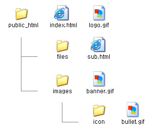

# [STS-10] 웹프로그래밍 :: 짧고 굵게 배우기

[![Dinfree][din-badge]][din-url]
[![Subject][basic-badge]][din-url]

[STS-10]은 웹프로그래밍의 핵심 개념에서 부터 주요 기술인 html, css, javascript를 비롯해 필수 응용 라이브러리인 bootstrap, jquery까지를 다루는 과정 입니다.

## HTML - 이미지와 테이블
이미지를 삽입하는 방법을 알아보고 절대경로와 상대경로를 통해 이미지의 경로를 나타내는 방법을 알아봅니다. 또한 HTML에서 테이블을 만드는 방법을 학습하고 테이블을 병합하는 것을 알아봅니다.

### 목차
1. [이미지](#m1)
2. [테이블](#m2)

---
<a id="m1"></a>

## 1. 이미지
이미지를 삽입하기 위해서 `` 태그를 사용합니다. `src`속성으로 이미지 경로를 지정하고 `width`와 `height`로 이미지의 크기를 조정할 수 있습니다. 또한 `alt`속성은 이미지를 표시하지 못할 경우 표시되는 대체 텍스트를 지정 합니다. 이미지의 경로는 절대경로 및 상대경로로 설정 할 수 있습니다. 


<!--이미지 주소 : https://www.miltonmarketing.com/coding/html/the-image-tag/-->

- ``의 형식으로 사용되며 `src`는 필수 속성입니다.
- `width`와 `height`는 이미지의 가로, 세로 길이를 픽셀(pixel) 단위로 지정합니다.
- % 단위 사용시 브라우저 크기에 따라 이미지 크기가 조절되도록 지정할 수 있습니다.

### 동영상 강좌
- img 태그 
  > http://bit.ly/2JOxdJB `10:39`
- 이미지 태그 사용하기 (이미지 URL 사용) 
  > http://bit.ly/2LfwC9F `04:18`
- 이미지 태그 사용하기 (이미지 경로 사용) 
  > http://bit.ly/2mDsSzX `04:54`
- 이미지 경로 
  > http://bit.ly/2uTCavn `13:08`


### 참고 자료
- img 태그
  > http://bit.ly/2NBIvTO
- HTML Images
  > http://bit.ly/2JLirDA
- 이미지를 삽입하는 방법, 이미지 경로 , 이미지 포맷, 이미지 정렬
  > http://bit.ly/2mEeYgY
- img 태그
  > http://bit.ly/2JNEOZ0


### 퀴즈
#### 1) 다음 이미지를 보고 `sub.html`에서 `banner.gif` 파일을 불러오는 경로를 절대경로와 상태경로로 표현하시오.

<!--이미지 주소 : http://soweb.tistory.com/entry/HTML%EA%B0%95%EC%A2%8C-%EC%A0%88%EB%8C%80%EA%B2%BD%EB%A1%9C%EC%99%80-%EC%83%81%EB%8C%80%EA%B2%BD%EB%A1%9C-->
<details>
<summary>해답보기</summary>
<p></p>
<div markdown="1">

- 절대 경로 : /images/banner.gif
- 상대 경로 : ../images/banner.gif

</div>
</details>

#### 2) 이미지 태그의 필수속성은 무엇입니까?
<details>
<summary>해답보기</summary>
<p></p>
<div markdown="1">

> 이미지의 경로를 설정하는 src는 필수 속성입니다.

</div>
</details>

<br>

---
<a id="m2"></a>

## 2. 테이블
표를 만들기 위해 `<tabel>`태그를 사용합니다. 행과 열을 표현하기 위해 `<tr>`, `<td>`, `<th>`같은 태그와 함께 작성합니다. `<tr>`을 사용해 표의 행을 정의하고 `<td>`를 사용해 각 행에서 칸(열)을 나누는 기능을 합니다. 표의 머리를 정의할 때는 `<th>` 태그를 사용합니다. 


<!--이미지 주소 : https://poiemaweb.com/html5-tag-list-table-->

- `colspan`을 사용하여 열을 확장하며 `rowspan`을 사용하여 행을 확장합니다.
- 테이블의 경계선 두께 지정을 위해 `border`속성을 사용합니다.
- 레이아웃을 목적으로 테이블을 사용하는 것은 권장하지 않습니다.

### 동영상 강좌
- 테이블 태그 
  > http://bit.ly/2uHCtKj `06:53`
- 표 병합 
  > http://bit.ly/2LGG95I `05:09`
- 테이블 행 그룹으로 나누기 
  > http://bit.ly/2OajH6z (13:00~17:35) `04:35`


### 참고 자료
- table 태그
  > http://bit.ly/2uIZFrM
- HTML Tables
  > http://bit.ly/2LyUCDK
- 테이블, 열과 행의 확장, 여백과 경계선
  > http://bit.ly/2uTCIkV
- col, table, td, th, tr 태그
  > http://bit.ly/2LHjENY


### 퀴즈
#### 1) 테이블에서 하나의 요소를 나타내기 위해 사용하는 태그는 무엇입니까?
<details>
<summary>해답보기</summary>
<p></p>
<div markdown="1">

```html
<td></td>
```

</div>
</details>

#### 2) 3행 5열로 이루어진 테이블을 생성하시오.
<details>
<summary>해답보기</summary>
<p></p>
<div markdown="1">

```html
<table>
    <tr>
        <td></td>
        <td></td>
        <td></td>
        <td></td>
        <td></td>
    </tr>
    <tr>
        <td></td>
        <td></td>
        <td></td>
        <td></td>
        <td></td>
    </tr>
    <tr>
        <td></td>
        <td></td>
        <td></td>
        <td></td>
        <td></td>
    </tr>
<table>
```

</div>

</details>

#### 3) 2개의 행을 합치는 방법을 서술하시오
<details>
<summary>해답보기</summary>
<p></p>
<div markdown="1">

```html
<td rowspan="2">
```

</div>
</details>


[din-badge]:https://img.shields.io/badge/dinfree-edu-orange.svg
[din-url]:https://github.com/dinfree
[basic-badge]:https://img.shields.io/badge/core-basic-green.svg