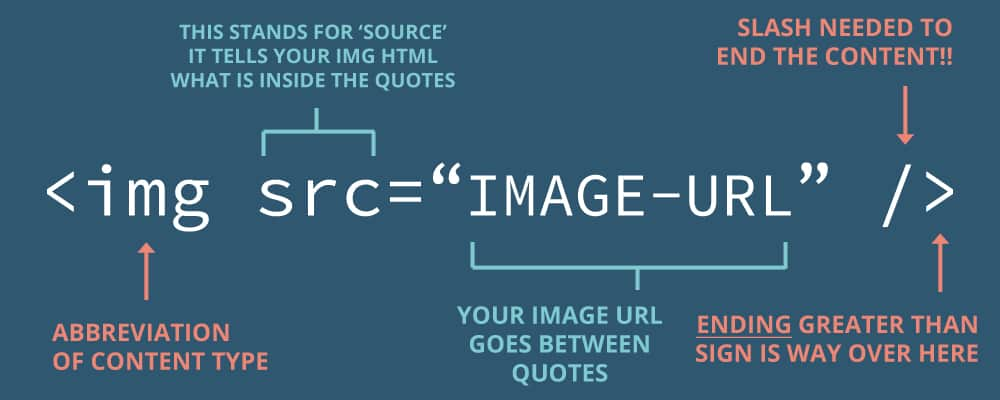

# [STS-10] 웹프로그래밍 :: 짧고 굵게 배우기

[![Dinfree][din-badge]][din-url]
[![Subject][basic-badge]][din-url]

[STS-10]은 웹프로그래밍의 핵심 개념에서 부터 주요 기술인 html, css, javascript를 비롯해 필수 응용 라이브러리인 bootstrap, jquery까지를 다루는 과정 입니다.

## HTML: 이미지와 테이블
이부분은 해당 챕터에 대한 설명과 안내가 나와야 하는데 우선 이부분은 비워 두도록 한다. 이부분은 해당 챕터에 대한 설명과 안내가 나와야 하는데 우선 이부분은 비워 두도록 한다.이부분은 해당 챕터에 대한 설명과 안내가 나와야 하는데 우선 이부분은 비워 두도록 한다.이부분은 해당 챕터에 대한 설명과 안내가 나와야 하는데 우선 이부분은 비워 두도록 한다.이부분은 해당 챕터에 대한 설명과 안내가 나와야 하는데 우선 이부분은 비워 두도록 한다.

### 목차
1. 이미지
2. 테이블

---
## 1. 이미지
이미지를 삽입하기 위해서 `` 태그를 사용한다. `src` 속성을 통해 이미지 경로를 지정하고 `width`와 `height`를 통해 이미지의 크기를 조정할 수 있다. 또한 `alt`속성은 이미지를 표시하지 못할 경우 표시되는 대체 텍스트를 지정 한다. 이미지의 경로는 절대경로 및 상대경로로 설정 할 수 있다. 


<!--이미지 주소 : https://www.miltonmarketing.com/coding/html/the-image-tag/-->


- `img src="이미지 파일이 저장 된 경로">`의 형식으로 사용한다. `src`속성은 필수속성이다.
- `width`와 `height`는 이미지의 가로, 세로 길이를 픽셀(pixel) 단위로 지정한다. `%`단위 사용하면 브라우저 크기에 따라 이미지 크기가 조절 되도록 지정 할 수 있다.

### 동영상 강좌
- img 태그 (10:39)
  > http://bit.ly/2JOxdJB
- 이미지 태그 사용하기 (이미지 URL 사용) (4:18)
  > http://bit.ly/2LfwC9F
- 이미지 태그 사용하기 (이미지 경로 사용) (4:54)
  > http://bit.ly/2mDsSzX
- 이미지 경로 (13:08)
  > http://bit.ly/2uTCavn

### 참고 자료
> pdf, ppt, slideshare, 관련정보사이트 등 충분하게. 영상과 마찬가지로 추후 설명이 추가 되어야 함.
- img 태그: http://bit.ly/2NBIvTO
- HTML Images: http://bit.ly/2JLirDA
- 이미지를 삽입하는 방법, 이미지 경로 , 이미지 포맷, 이미지 정렬: http://bit.ly/2mEeYgY
- img 태그: http://bit.ly/2JNEOZ0

### 퀴즈
#### 1) 다음 이미지를 보고 `sub.html`에서 `banner.gif` 파일을 불러오는 경로를 절대경로와 상태경로로 표현하시오

<!--이미지 주소 : http://soweb.tistory.com/entry/HTML%EA%B0%95%EC%A2%8C-%EC%A0%88%EB%8C%80%EA%B2%BD%EB%A1%9C%EC%99%80-%EC%83%81%EB%8C%80%EA%B2%BD%EB%A1%9C-->
<details>
<summary>해답보기</summary>
<p></p>
<div markdown="1">

```
절대 경로 : /images/banner.gif
상대 경로 : ../images/banner.gif
```

</div>

</details>

#### 2) 이미지 태그의 필수속성은 무엇인가
<details>
<summary>해답보기</summary>
<p></p>
<div markdown="1">

```
이미지의 경로를 설정하는 src 속성은 필수적으로 적어줘야 한다.
```
</div>

</details>

## 2. 테이블
표를 만들기 위해 `<tabel>`태그를 사용한다. 행과 열을 표현하기 위해 `<tr>`과 `<td>`, `<th>`같은 태그와 함께 작성한다. `<tr>`을 사용해 표의 행을 정의하고, `<td>`를 사용해 각 행에서 칸(열)을 나누는 기능을 한다. 표의 머리를 정의할 때는 `<th>` 태그를 사용한다. 


<!--이미지 주소 : https://poiemaweb.com/html5-tag-list-table-->


- `colspan`을 사용하여 열을 확장하며, `rowspan`을 사용하여 행을 확장한다.
- 테이블의 경계선 두께 지정을 위해 `border`속성을 사용한다.
- 레이아웃을 목적으로 테이블을 사용하는 것은 옳지 않다.

### 동영상 강좌
- 테이블 태그 (6:53)
  > http://bit.ly/2uHCtKj
- 표 병합 (5:09)
  > http://bit.ly/2LGG95I
- 테이블 행 그룹으로 나누기 (4:35)
  > http://bit.ly/2OajH6z (13:00~17:35)


### 참고 자료
> pdf, ppt, slideshare, 관련정보사이트 등 충분하게. 영상과 마찬가지로 추후 설명이 추가 되어야 함.
- table 태그: http://bit.ly/2uIZFrM
- HTML Tables: http://bit.ly/2LyUCDK
- 테이블, 열과 행의 확장, 여백과 경계선: http://bit.ly/2uTCIkV
- col, table, td, th, tr 태그: http://bit.ly/2LHjENY

### 퀴즈
#### 1) 테이블에서 하나의 요소를 나타내기 위해 사용하는 태그는 무엇인가
<details>
<summary>해답보기</summary>
<p></p>
<div markdown="1">

```
<td></td>
```

</div>

</details>

#### 2) 3행 5열로 이루어진 테이블을 생성하시오
<details>
<summary>해답보기</summary>
<p></p>
<div markdown="1">

```
<table>
    <tr>
        <td></td>
        <td></td>
        <td></td>
        <td></td>
        <td></td>
    </tr>
    <tr>
        <td></td>
        <td></td>
        <td></td>
        <td></td>
        <td></td>
    </tr>
    <tr>
        <td></td>
        <td></td>
        <td></td>
        <td></td>
        <td></td>
    </tr>
<table>
```

</div>

</details>

#### 3) 2개의 행을 합치는 방법을 서술하시오
<details>
<summary>해답보기</summary>
<p></p>
<div markdown="1">

```
<td rowspan="2">
```

</div>

</details>


[din-badge]:https://img.shields.io/badge/dinfree-edu-orange.svg
[din-url]:https://github.com/dinfree
[basic-badge]:https://img.shields.io/badge/core-basic-green.svg
