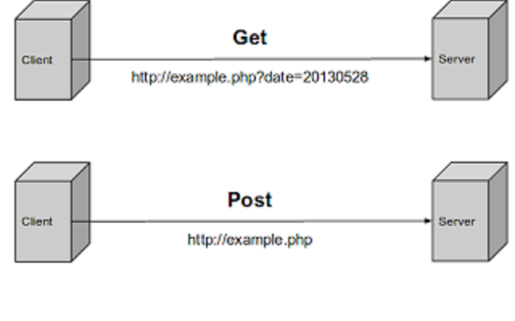

# [STS-10] 웹프로그래밍 :: 짧고 굵게 배우기

[![Dinfree][din-badge]][din-url]
[![Subject][basic-badge]][din-url]

[STS-10]은 웹프로그래밍의 핵심 개념에서 부터 주요 기술인 html, css, javascript를 비롯해 필수 응용 라이브러리인 bootstrap, jquery까지를 다루는 과정 입니다.

## HTML: 입력양식
이부분은 해당 챕터에 대한 설명과 안내가 나와야 하는데 우선 이부분은 비워 두도록 한다. 이부분은 해당 챕터에 대한 설명과 안내가 나와야 하는데 우선 이부분은 비워 두도록 한다.이부분은 해당 챕터에 대한 설명과 안내가 나와야 하는데 우선 이부분은 비워 두도록 한다.이부분은 해당 챕터에 대한 설명과 안내가 나와야 하는데 우선 이부분은 비워 두도록 한다.이부분은 해당 챕터에 대한 설명과 안내가 나와야 하는데 우선 이부분은 비워 두도록 한다.

### 목차
1. 입력 양식이란
2. 입력 양식 태그
3. 다양한 입력 양식 태그

---
## 1. 입력 양식이란
입력 양식은 사용자에게 정보를 입력 받을 때 사용된다. 기본적으로 `<form>`태그가 사용되나, 
`<form> </form>` 사이에 다양한 form 요소들을 위치시켜줘야 된다. form 태그에서 사용 할 수 있는 속성은 `method`와 `action`이 있다. `method`는 웹 서버와의 통신 방법을 지정한다. `get`과 `post` 두 가지 값이 존재한다. `action`은 입력 받은 값을 저장할 페이지를 지정한다. 
<br><br>

```html
<form action="#" method="get">
  <fieldset>
    <legend>Shipping Address</legend>
    <p>name: <input type="text" name="Name" /></p>
    <p>Address: <input type="text" name="Address" /></p>
    <p>City: <input type="text" name="City" /></p>
    <p>State: <input type="text" name="State" /></p>
    <p>zip: <input type="text" name="Zip" /></p>
  </fieldset>
</form>
```
<details>
<summary>실행 결과 보기</summary>
<p></p>
<div markdown="1">
<form action="#" method="get">
  <fieldset>
    <legend>Shipping Address</legend>
    <p>name: <input type="text" name="Name" /></p>
    <p>Address: <input type="text" name="Address" /></p>
    <p>City: <input type="text" name="City" /></p>
    <p>State: <input type="text" name="State" /></p>
    <p>zip: <input type="text" name="Zip" /></p>
  </fieldset>
</form>
</div>
</details><br><br>

<!--이미지 주소 : https://opentechlabs.blogspot.com/2014/10/difference-between-post-get.html -->

- `<form>`은 입력양식의 최상위 요소로 입력양식의 범위를 지정한다. 
- `get`은 URL뒤에 파라미터를 붙여서 데이터를 전달한다. `post`방식은 URL 뒤에 파라미터를 붙여서 전송하지 않고, HTTP Request 헤더에 파라미터를 붙여서 전송한다. get방식에 비해 보안상 우위에 있다. 

### 동영상 강좌
- form 기본 (12:19)
  > http://bit.ly/2uHYadt
- GET과 POST의차이 (10:03)
  > http://bit.ly/2A9oa6m


### 참고 자료
> pdf, ppt, slideshare, 관련정보사이트 등 충분하게. 영상과 마찬가지로 추후 설명이 추가 되어야 함.
- form 태그: http://bit.ly/2uJ2cSO
- HTML Forms: http://bit.ly/2uRY2XY


### 퀴즈
#### 1) form 태그의 action에 들어가야 되는 내용은 무엇인가

<details>
<summary>해답보기</summary>
<p></p>
<div markdown="1">

```
입력 받은 값을 저장할 페이지를 지정해준다.
```

</div>

</details>

#### 2) get방식과 post 방식의 차이에 대해 서술하시오
<details>
<summary>해답보기</summary>
<p></p>
<div markdown="1">

```
get방식은 URL 뒤에 파라미터를 붙여서 데이터를 전달하는 방식이다. 
post 방식은 HTTP Request 헤더에 파라미터를 붙여서 전송하여 보안에 좋다. 
```
</div>

</details>

## 2. 입력 양식 태그
실제로 사용자가 양식을 입력하기 위한 태그는 `<input>`을 사용한다. `type` 속성을 통해 입력 양식의 종류를 나타내고, `name`을 통해 데이터 이름을, `value`을 통해 기본 값을 지정한다. 

| Tag | Description | 
|:----:|:-----:| 
|`<form>` | Defines a form for user input |
|`<input>` | Defines am input field |
|`<textarea>` | Defines a text-area (a multi-line text input control) |
|`<label>` | Defines a label to a control |
|`<fieldset>` | Defines a fieldset |
|`<legend>` | Defines a caption for a fieldset |
|`<select>` | Defines a selectable list (a drop-down box) |
|`<optgroup>` | Defines an option group |
|`<option>` | Defines an option in the drop-down box |
|`<button>` | Defines a push button |
|`<isindex>` | Deprecated. use `<input>` instead |   


<!--이미지 주소 : https://poiemaweb.com/html5-tag-list-table-->


- `type`는 필수 속성이며 사용할 수 있는 값에는 텍스트 입력 필드인 `text`, 비밀번호 입력필드인 `password`, 복수 선택 가능한 체크 박스 생성하는 `checkbox`, 복수 선택 불가능한 라디오 버튼 생성하는 `radio`, 송신 버튼인 `submit`, 리셋 버튼인 `reset`, 범용 버튼인 `button` 등이 있다. 
- `name` 속성에 폼의 이름을 설정해준다. name 속성의 값은 변수처럼 사용된다. 
- `fieldset`은 연관성 있는 입력 양식들을 하나로 묶을 수 있게 해주며, `legend`는 제목을 붙이는 역할을 한다. 


### 동영상 강좌
- 폼 관련 태그들 (12:11)
  > http://bit.ly/2mAvZIN
- input type (10:11)
  > http://bit.ly/2JNfdPJ
- input 태그 color 속성 (1:03)
  > http://bit.ly/2uXDg9s
- input 태그 date, month, week 속성 (2:24)
  > http://bit.ly/2JNfYs3
- fildset (6:52)
  > http://bit.ly/2mAVlWU
- 회원가입 폼 태그 예제 (23:00)
  > http://bit.ly/2uWddPS (~23:00)


### 참고 자료
> pdf, ppt, slideshare, 관련정보사이트 등 충분하게. 영상과 마찬가지로 추후 설명이 추가 되어야 함.
- button, form, input 태그: http://bit.ly/2uVyY2b


### 퀴즈
#### 1) 텍스트 입력란을 만들어라
<details>
<summary>해답보기</summary>
<p></p>
<div markdown="1">

```
<form>
    <input type="text">
</form>
```

</div>

</details>

#### 2) 제출 버튼을 만들기 위해 사용하는 input 태그의 속성은 무엇인가
<details>
<summary>해답보기</summary>
<p></p>
<div markdown="1">

```
submit
```

</div>

</details>

#### 3) 다음 중 input 태그의 속성이 아닌 것은 무엇인가
1. type
2. action
3. name
4. value
<details>
<summary>해답보기</summary>
<p></p>
<div markdown="1">

`정답 : 2번`
> action은 form의 속성이다.
</div>

</details>


[din-badge]:https://img.shields.io/badge/dinfree-edu-orange.svg
[din-url]:https://github.com/dinfree
[basic-badge]:https://img.shields.io/badge/core-basic-green.svg
