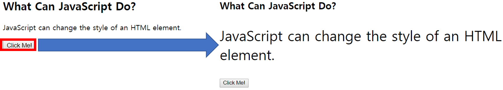

# [STS-10] 웹프로그래밍 :: 짧고 굵게 배우기

[![Dinfree][din-badge]][din-url]
[![Subject][basic-badge]][din-url]

[STS-10]은 웹프로그래밍의 핵심 개념에서 부터 주요 기술인 html, css, javascript를 비롯해 필수 응용 라이브러리인 bootstrap, jquery까지를 다루는 과정 입니다.

 ## JavaScript
이 챕터에서는 웹개발자가 필수로 알아야하는 JavaScript 언어가 무엇인지, 어떤 특징을 가지고있는지, 기본 문법과 구문을 알아보고, JavaScript의 사용방법에 대해 소개합니다.


### 목차
1. [소개](#m1)
2. [기본문법](#m2)

---
<a id="m1"></a>

## 1. 소개
JavaScript는 객체(object) 기반의 스크립트 언어로 `웹의 동작`을 구현할 수 있습니다. JavaScript는 주로 웹 브라우저에서 사용되나 Node.js와 같은 프레임워크를 사용하면 `서버 프로그래밍`에서도 사용할 수 있습니다. 현재 컴퓨터나 스마트폰 등에 포함된 대부분의 웹 브라우저에는 JavaScript 인터프리터가 내장되어 있습니다.


- JavaScript는 동적이며 타입을 명시할 필요가 없는 `인터프리터 언어`입니다.
> 인터프리터 언어란 컴파일 작업을 거치지 않고, 소스 코드를 바로 실행할 수 있는 언어를 의미합니다. JavaScript는 웹 브라우저에 포함된 JavaScript 인터프리터가 소스 코드를 직접 해석하여 바로 실행해 줍니다.
- 객체지향 프로그래밍과 함수형 프로그래밍을 모두 표현할 수 있습니다.
- HTML의 내용, 속성, 스타일을 변경 할 수 있습니다.


### 동영상 강좌
- JavaScript 개요
  > https://bit.ly/2LIT1YP `03:18`
- JavaScript 기본구조
  > https://bit.ly/2JKOZh3 `13:05`
- JavaScript  오리엔테이션
  > https://bit.ly/2LdYPxr `23:51`
- What is JavaScript?
  > https://bit.ly/2LwOuMc `02:16`
- How Javascript works
  > https://bit.ly/2LdZuip `03:42`
- What Is JavaScript? What Does It Do?
  > https://bit.ly/2Lgcdkt `05:23`

### 참고 자료
- JavaScript Introduction
  > https://bit.ly/2o4KTKt 
- JavaScript 입문
  > https://bit.ly/2uI2GbP 

### 퀴즈
#### 1) 인터프리터 언어란 무엇인가요?
<details>
<summary>해답보기</summary>
<p></p>
<div markdown="1">

> 컴파일 작업을 거치지 않고, 소스 코드를 바로 실행할 수 있는 언어입니다 

</div>
</details>


#### 2) JavaScript는 HTML으로 작성한 내용을 숨기거나 바꿀 수 있다. (O/X)
<details>
<summary>해답보기</summary>
<p></p>
<div markdown="1">

- O



</div>
</details>

<br>

---
<a id="m2"></a>

## 2. 기본 문법

HTML에서 JavaScript 코드는 반드시 \<script>태그 사이에 작성해야합니다. JavaScript의 실행문은 세미콜론(;)으로 구분됩니다.

#### 1) 변수 선언 
- 기본적으로 `var`키워드로 변수를 선언할 수 있습니다.
- 변수이름은 `대소문자를 구별`합니다.
- 변수는 한 번에 여러 개 선언할 수 있습니다.
- 변수에는 지역변수와 전역변수가 있습니다.

```javascript
var number, NUMBER;
number = 10;
```

#### 2) string 변수
- string 변수는 `큰따옴표(" ") 또는 작은따옴표(' ')`로 표현할 수 있습니다.

```javascript
var string;
string = "Java Script";
```

#### 3) 배열 선언
- 배열(array)은 키와 인덱스로 참조되는 정렬된 값의 집합으로 정의됩니다.
- 배열을 구성하는 각각의 `값은 배열 요소(element)`라고 하며, 그 `위치는 인덱스(index)`라고 합니다.

```js
var korea = ['seoul', 'busan', 'incheon'];
alert(korea[1]); // 'busan'
```

#### 4) 출력 방법
- innerHTML 사용하여 HTML요소에 작성.
```html
<script>
document.getElementById("id").innerHTML = 5 + 6;
</script>
```

- document.write() 사용하여 HTML출력에 쓰기.
```html
<script>
document.write(5 + 6);
</script>
```

- window.alert() 사용하여 알림창에 쓰기.
```html
<script>
window.alert(5 + 6);
</script>
```

- console.log() 사용하여 브라우저 콘솔에 기록. 
```html
<script>
console.log(5 + 6);
</script>
```
#### 5) 연산자
- 변수 값은 사칙연산으로 계산될 수 있습니다.
```javascript
var a, b, c;
a = 10;
b = 5;
c = a * b;
```

- 비교연산자

| Operator | Description                       |
|:----------:|-----------------------------------|
| ==       | equal to                          |
| ===      | equal value and equal type        |
| !=       | not equal                         |
| !==      | not equal value or not equal type |
| >        | greater than                      |
| <        | less than                         |
| >=       | greater than or equal to          |
| <=       | less than or equal to             |
| ?        | ternary operator                  |


- 논리연산자

| Operator | Description |
|:-------:|-------------|
| &&      | logical and |
|  \|\|	  | logical or  |
| !       | logical not |

#### 6) 주석달기

```js
// single-line comment

/* 
multi-line comment
multi-line comment
*/
```

#### 7) 적용방법
  
- 내부 JavaScript
```html
<script>
    document.getElementById("text").innerHTML = "hello javascript!";
</script>
```

- 외부 JavaScript
  - 외부 JavaScript 사용시 웹의 HTML코드로부터 웹의 동작을 구현하는 JavaScript 코드를 분리할 수 있습니다.
  - HTML코드와 JavaScript코드를 읽기가 수월해지고 유지 보수도 간편해집니다.
  - 외부 JavaScript은 웹 브라우저가 미리 읽어 올 수 있어 웹 페이지의 로딩 속도가 빨라집니다.
```js
//example.js 파일
function printDate() {
  document.getElementById("date").innerHTML = Date();
}
```
```html
<head>
    <script src="/examples/media/example.js"></script>
</head>
```


### 동영상 강좌

- JavaScript의 기본적인 문법 
  > https://bit.ly/2JLD2r7 `17:24`
- JavaScript의 기본 구문
  > https://bit.ly/2uTsIbt `14:58`
- JavaScript 기초 
  > https://bit.ly/2NETqMr `10:43`
- JavaScript 기초 문법
  > https://bit.ly/2A1SHD5 `34:13`
- JavaScript 변수 사용법
  > https://bit.ly/2mABwiH `06:41`
- JavaScript 반복문
  > https://bit.ly/2JQyyQ6 `11:08`
- JavaScript_반복문
  > https://bit.ly/2mHdR09 `08:07`
- JavaScript -조건문
  > https://bit.ly/2uJDscV `06:07`
- JavaScript 제어문
  > https://bit.ly/2mDd14p `19:50`
- JavaScript –조건문의 응용 (비교 연산자)
  > https://bit.ly/2Lxtrt5 `12:57`
- JavaScript -배열의 문법
  > https://bit.ly/2LGMZYP `09:15`

    
### 참고 자료
- 기본문법
  > https://bit.ly/2uZXAH4
- 변수 
  > https://bit.ly/2o4KTKt
- 반복문
  > https://bit.ly/2uihsHw
- 조건문
  > https://bit.ly/2GsFuCh


### 퀴즈
#### 1) JavaScript에서 변수를 선언하는 키워드는 무엇입니까?
<details>
<summary>해답보기</summary>
<p></p>
<div markdown="1">

- var

</div>
</details>

#### 2) JavaScript코드를 작성하기 위한 태그는 무엇입니까?
<details>
<summary>해답보기</summary>
<p></p>
<div markdown="1">

- \<script> \</script>

</div>
</details>

#### 3) JavaScript에서 변수의 값을 출력하기 위한 코드 한줄을 작성하세요.
<details>
<summary>해답보기</summary>
<p></p>
<div markdown="1">

```html
<script>
  var a = "JavaScript";
  document.write(a);
</script>
```
</div>
</details>


[din-badge]:https://img.shields.io/badge/dinfree-edu-orange.svg
[din-url]:https://github.com/dinfree
[basic-badge]:https://img.shields.io/badge/core-basic-green.svg