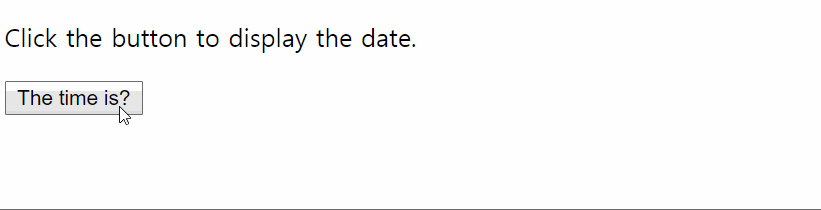
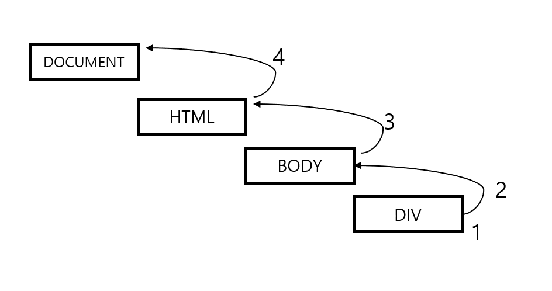
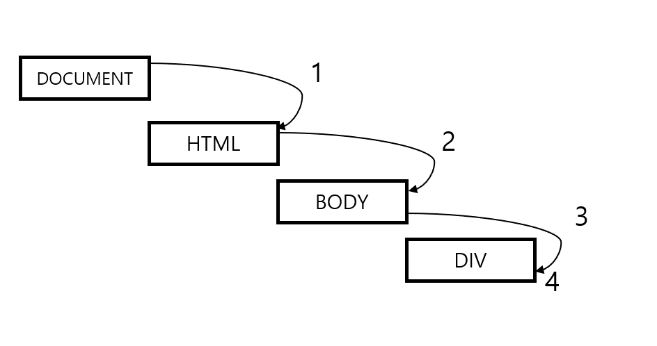
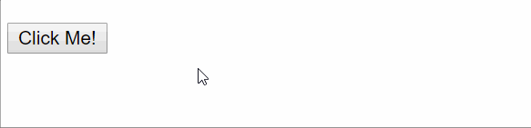

# [STS-10] 웹프로그래밍 :: 짧고 굵게 배우기

[![Dinfree][din-badge]][din-url]
[![Subject][basic-badge]][din-url]

[STS-10]은 웹프로그래밍의 핵심 개념에서 부터 주요 기술인 html, css, javascript를 비롯해 필수 응용 라이브러리인 bootstrap, jquery까지를 다루는 과정 입니다.

## JavaScript - 함수와 이벤트 처리
JavaScript의 기초적인 함수 사용법과 이벤트처리는 어떻게 하고, 어떤 방식이 있는지, 왜 사용하는지 알아봅니다. 

### 목차
1. [함수](#m1)
2. [이벤트처리](#m2)

---
<a id="m1"></a>

## 1. 함수

#### 1) 함수란
- 함수(function)란 하나의 특별한 목적의 작업을 수행하도록 설계된 독립적인 블록을 의미합니다.
- 이러한 함수는 필요할 때마다 호출하여 해당 작업을 반복해서 수행할 수 있습니다.
- 함수도 하나의 타입(datatype)입니다. 따라서 함수를 변수에 대입하거나, 함수에 프로퍼티를 지정하는 것도 가능합니다.
- JavaScript 함수는 다른 함수 내에 중첩되어 정의될 수도 있습니다.

'

#### 2) 함수 선언 방법
- JavaScript에서 함수는 `function`이라는 키워드를 통해 정의됩니다. 
- 함수명은 변수처럼 지어질 수 있으며 파라미터를 가지고 있습니다.

```js
function name (one, two){
    함수 기능
}
```

#### 3) 함수 리턴값
- 함수는 호출되면 리턴값을 내놓습니다.

```js
var a = name(2,3); 
function name (x,y){
    return x*y;
}
alert(a); // 6
```

- 함수의 리턴값이 없는 경우

```js
/* addNum 함수 정의.
   x, y : 함수의 매개변수.
*/
function addNum(x, y) {   
    document.write(x + y);
}
// addNum() 함수에 인수로 2와 3을 전달하여 호출.
addNum(2, 3);              
```

### 동영상 강좌
- JavaScript 함수란?
    > https://bit.ly/2zY2xWG `10:07`
- 함수 사용하기
    > https://bit.ly/2uXlXW9  `05:44`
- JavaScript Functions
    > https://bit.ly/2mzrSN0 `06:28`
- Javascript Functions Tutorial
    > https://bit.ly/2uW6qpn `13:49`
- JavaScript 함수 (리턴)
    > https://bit.ly/2Lwu7Pn `07:19`


### 참고 자료
- JavaScript Function Definitions
    > https://bit.ly/2Lf4eV0
    

### 퀴즈
#### 1) JavaScript를 이용하여 두 값을 합하는 함수를 정의하세요.
<details>
<summary>해답보기</summary>
<p></p>
<div markdown="1">

```javascript
function add(a,b){
    return a+b;
}
```
</div>
</details>

#### 2) 위의 정의한 함수를 호출하세요.
<details>
<summary>해답보기</summary>
<p></p>
<div markdown="1">

```javascript
var x = add(4,3);
```
</div>
</details>

---
<a id="m2"></a>

## 2. 이벤트처리
 
- 이벤트(event)란 웹 브라우저가 알려주는 `HTML요소에 대한 사건의 발생`을 의미합니다.
- 웹 페이지에 사용된 자바스크립트는 이렇게 발생한 이벤트에 반응하여 특정 동작을 수행할 수 있습니다. 
- 사용자의 입력값을 가져올 수 있습니다.
- HTML이벤트 속성은 JavaScript를 직접 실행할 수 있고 함수를 호출할 수 있습니다.
- HTML요소에 고유한 이벤트 핸들러 함수를 할당할 수 있습니다.
- 이벤트가 잘못 보내지거나 처리되는 것을 막을 수 있습니다.

```javascript
//ex) 클릭이벤트(버튼을 누르면 날짜 표시)
<!DOCTYPE html>
<html>
<body>
    <p>Click the button to display the date.</p>
    <button onclick="displayDate()">The time is?</button>
    <script>
        function displayDate() {
            document.getElementById("demo").innerHTML = Date();
        }
    </script>
    <p id="demo"></p>
</body>
</html> 
```

> 결과




### 버블링 & 캡처링 방식

```html
<!DOCTYPE html> 
<html>
    <head> 
        <title>이벤트 버블링 예제</title> 
    </head> 
    <body> 
        <div id="mydiv">Click Me</div> 
    </body> 
</html>
```
- `#mydiv`를 클릭하면 이벤트가 발생합니다.

#### 1) 버블링
`이벤트가 자식으로부터 발생하여 부모로 전파되는 방식`입니다. 이벤트가 발생하면 트리 위치가 가장 깊은 곳부터 거슬러 올라가게 되고 이 모습이 마치 거품이 올라가는 것과 같아 이벤트 버블링이라고 불립니다.
- div → body → html → document



#### 2) 캡처링
이벤트 버블링과 정반대로 `최상위 노드에서 이벤트가 발생`합니다. 위의 이벤트 버블링 때 처럼 div요소를 클릭했을 때 아래 순서로 이벤트가 발생합니다.
- document → html → body → div




### 동영상 강좌
- JavaScript – 이벤트
  > https://bit.ly/2NzNcxG  `04:24`
- 자바스크립트 이벤트 사용법
  > https://bit.ly/2O9IpnF `17:07`
- JavaScript - 이벤트전파 (1/3) : 소개
  > https://bit.ly/2O8OcK5 `05:08`
- JavaScript - 이벤트전파 (2/3) : 캡처링
  > https://bit.ly/2NCqsNq `10:38`
- JavaScript - 이벤트전파 (3/3) : 버블링
  > https://bit.ly/2LyDaPK `10:27`
- JavaScript - 마우스 이벤트
  > https://bit.ly/2JKCUbG `14:19`
- JavaScript - 폼 이벤트
  > https://bit.ly/2LtfxZ0 `08:43`
- JavaScript - 문서로드 이벤트
  > https://bit.ly/2Lhg1SR `10:19`
    

### 참고 자료
- JavaScript Events
  > https://bit.ly/2AzCdRP


### 퀴즈
#### 1) onClick 이벤트를 이용하여 버튼을 누르면 "hello world" 문구가 나오도록 하세요(힌트: style="display:none")
<details>
<summary>해답보기</summary>
<p></p>
<div markdown="1">

```html
<!DOCTYPE html>
<html>
    <body>
    <p></p>
    <p id="id" style="display:none">Hello World!</p>
    <button type="button" onclick="document.getElementById('id').style.display='block'">Click Me!</button>
    </body>
</html> 
```



</div>
</details>


[din-badge]:https://img.shields.io/badge/dinfree-edu-orange.svg
[din-url]:https://github.com/dinfree
[basic-badge]:https://img.shields.io/badge/core-basic-green.svg